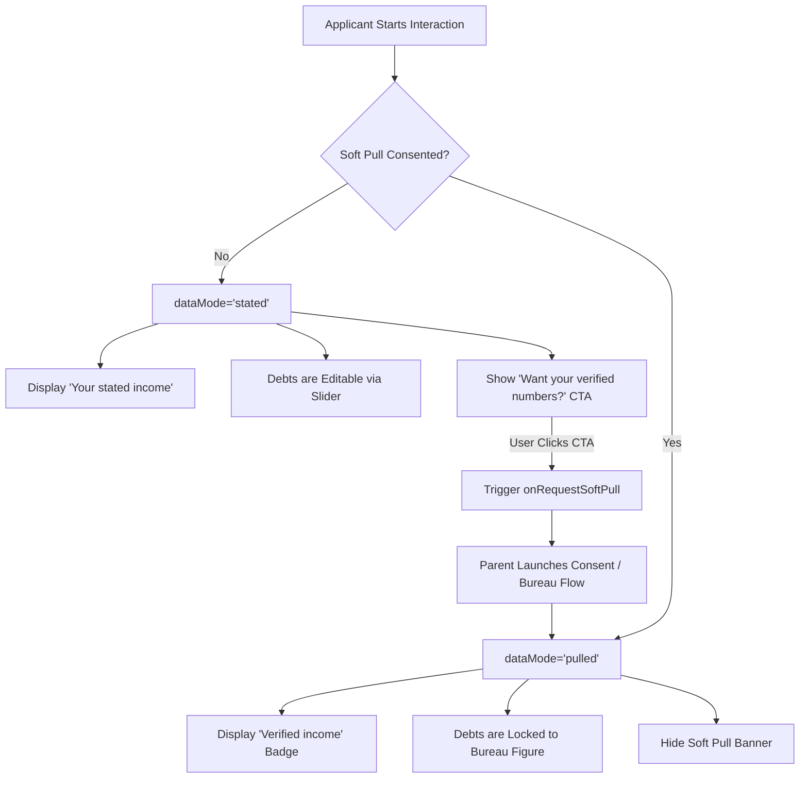

# Ailana Affordability Summary Panel — Complete Technical & UI Documentation

A self-contained, enterprise-grade React / Next.js component providing an interactive, educational **Affordability Summary Panel** for mortgage pre-qualification and scenario exploration.

Designed with a warm **ledger/paperwork motif** suitable for credit unions and mortgage lenders, this component supports 4 transaction modes, 4 loan programs, real-time client-side financial calculations, neutral guideline benchmark visualizations, and dual data modes (conversational stated estimates vs. bureau-verified figures).

---

## Table of Contents

1. [Project Overview & Architecture](#project-overview--architecture)
2. [Complete Source Code (`AffordabilityPanel.tsx`)](#complete-source-code-affordabilitypaneltsx)
3. [Props & TypeScript Interface](#props--typescript-interface)
4. [UI Design & Visual Hierarchy](#ui-design--visual-hierarchy)
   - [Design Tokens & Color Palette](#design-tokens--color-palette)
   - [Typography System](#typography-system)
   - [Subcomponent Breakdown](#subcomponent-breakdown)
5. [Financial & Calculation Engine](#financial--calculation-engine)
   - [Amortization & P&I](#amortization--pi)
   - [Loan Programs & Mortgage Insurance / Fees](#loan-programs--mortgage-insurance--fees)
   - [Debt-to-Income (DTI) & LTV Benchmarks](#debt-to-income-dti--ltv-benchmarks)
   - [HELOC Calculations](#heloc-calculations)
   - [Cash to Close & Payment Delta Calculations](#cash-to-close--payment-delta-calculations)
6. [Data Modes & Workflow](#data-modes--workflow)
   - [Stated Mode (`dataMode="stated"`)](#stated-mode-datamodestated)
   - [Pulled Mode (`dataMode="pulled"`)](#pulled-mode-datamodepulled)
7. [Step-by-Step Integration & Migration Guide](#step-by-step-integration--migration-guide)
   - [Quick Drop-in Installation](#quick-drop-in-installation)
   - [Usage Examples](#usage-examples)
   - [Replacing an Existing Affordability Panel UI](#replacing-an-existing-affordability-panel-ui)
8. [File Structure & Dependencies](#file-structure--dependencies)

---

## Project Overview & Architecture

### Key Highlights
- **Zero Heavy Dependencies**: Pure React 18+ and `lucide-react` icons. No Tailwind CSS or external CSS modules required—all styles are self-contained using an inline tokenized design system.
- **Client-Side Financial Sandbox**: Fully reactive state management allows applicants or loan officers to adjust sliders (price, down payment, interest rate, term, loan balance, cash-out, insurance, HOA) with instant recalculation.
- **Dual Data Mode Architecture**: Seamlessly toggles between conversational pre-qualification estimates (`"stated"`) and bureau-verified figures (`"pulled"`).
- **Compliance-Centric**: Follows SAFE Act guidelines with neutral band language (no hard cutoff/rejection phrasing), directional guidance, and integrated NMLS disclaimer footer.

```
ailana-affordability-panel/
├── app/
│   ├── globals.css          # Minimal CSS reset
│   ├── layout.tsx           # Demo root layout
│   └── page.tsx             # Demo preview route showcasing stated mode
├── components/
│   └── AffordabilityPanel.tsx # 🎯 Core self-contained component (Drop-in deliverable)
├── docs/                    # Compliance & prompt formulation specifications
├── package.json
└── tsconfig.json
```

---

## Complete Source Code (`AffordabilityPanel.tsx`)

Copy and paste the entire code below into `components/AffordabilityPanel.tsx` in your destination project:

```tsx
"use client";

import React, { useMemo, useState } from "react";
import { Shield, Info, SlidersHorizontal, CheckCircle2 } from "lucide-react";

/* ---------------------------------------------------------
   DESIGN TOKENS
   Ledger/paperwork motif for a credit-union mortgage assistant:
   warm paper surface, deep ledger-teal ink, brass accent for
   interactive controls, and a mono numeral face for all figures
   so the panel reads like a trustworthy statement, not a dashboard.
--------------------------------------------------------- */
const T = {
  paper: "#F5F2EA",
  card: "#FFFFFF",
  ink: "#1E2B29",
  inkSoft: "#5B6763",
  teal: "#2C5453",
  tealDeep: "#1B3736",
  brass: "#A9812F",
  brassLight: "#F1E7CE",
  line: "#DDD5C2",
  green: "#3E7A5C",
  greenBg: "#E9F1EA",
  amber: "#B8863B",
  amberBg: "#FAF0DE",
  red: "#A6452F",
  redBg: "#F7E9E3",
} as const;

// Font stacks kept local (no external @import) so the panel renders
// reliably in any embed context without a network round-trip for type.
const FONT_DISPLAY = `'Iowan Old Style', 'Palatino Linotype', Palatino, Georgia, serif`;
const FONT_SANS = `-apple-system, BlinkMacSystemFont, 'Segoe UI', 'Helvetica Neue', Arial, sans-serif`;
const FONT_MONO = `'SFMono-Regular', Consolas, 'Liberation Mono', Menlo, monospace`;

/* ---------------------------------------------------------
   TYPES
--------------------------------------------------------- */
export type ModeId = "purchase" | "refiRT" | "refiCO" | "heloc";
export type ProgramId = "conventional" | "fha" | "va" | "usda";
export type TransactionType = "TT-PUR" | "TT-REF" | "TT-HEL" | "TT-HEQ" | "TT-CON";
export type DataMode = "stated" | "pulled";

export interface Segment {
  label: string;
  value: number;
}

export interface ProgramConfig {
  label: string;
  minDownPct: number;
  upfrontFeePct: number;
  upfrontFeeLabel: string | null;
  miLabel: string;
  monthlyMi: (loanAmt: number, ltv: number) => number;
  miNote: (mi: number) => string;
  dtiFront: { guideline: number };
  dtiBack: { guideline: number };
  ltv: { guideline: number };
  compensating: string;
}

export interface Assumptions {
  price?: number;
  downPct?: number;
  homeValue?: number;
  payoff?: number;
  cashOut?: number;
  currentPayment?: number;
  rate?: number;
  term?: number;
  taxRatePct: number;
  insurance: number;
  hoaFee?: number;
  firstBalance?: number;
  lineAmount?: number;
  drawRate?: number;
  firstPI?: number;
}

export interface CalcResult {
  pitia: number;
  front: number;
  back: number;
  segments: Segment[];
  ltv?: number;
  cltv?: number;
  mi?: number;
  loanAmt?: number;
  baseLoan?: number;
  upfrontFee?: number;
  totalLiens?: number;
  delta?: number | null;
  cashBand?: [number, number] | null;
  exactCash?: number;
  pi?: number;
  tax?: number;
}

/* ---------------------------------------------------------
   LOAN MATH
--------------------------------------------------------- */
function monthlyPI(principal: number, annualRatePct: number, termYears: number): number {
  const r = annualRatePct / 100 / 12;
  const n = termYears * 12;
  if (r === 0) return principal / n;
  return (principal * r * Math.pow(1 + r, n)) / (Math.pow(1 + r, n) - 1);
}

function fmt(n: number, decimals = 0): string {
  return n.toLocaleString("en-US", { maximumFractionDigits: decimals, minimumFractionDigits: decimals });
}

function fmtPct(n: number): string {
  return `${n.toFixed(1)}%`;
}

/* ---------------------------------------------------------
   MODE DEFINITIONS
--------------------------------------------------------- */
const MODES: { id: ModeId; label: string }[] = [
  { id: "purchase", label: "Purchase" },
  { id: "refiRT", label: "Refi: Rate & Term" },
  { id: "refiCO", label: "Refi: Cash-Out" },
  { id: "heloc", label: "HELOC" },
];

function resolveMode(transactionType: TransactionType, cashOutIntent: boolean): ModeId {
  if (transactionType === "TT-PUR") return "purchase";
  if (transactionType === "TT-HEL") return "heloc";
  if (transactionType === "TT-REF") return cashOutIntent ? "refiCO" : "refiRT";
  return "purchase";
}

const DEFAULTS: Record<ModeId, Assumptions> = {
  purchase: { price: 550000, downPct: 15, rate: 6.375, term: 30, taxRatePct: 0.84, insurance: 130, hoaFee: 0 },
  refiRT: { homeValue: 500000, payoff: 300000, rate: 6.125, term: 30, taxRatePct: 0.84, insurance: 120, hoaFee: 0, currentPayment: 2204 },
  refiCO: { homeValue: 500000, payoff: 300000, cashOut: 30000, rate: 6.375, term: 30, taxRatePct: 0.84, insurance: 120, hoaFee: 0, currentPayment: 2204 },
  heloc: { homeValue: 500000, firstBalance: 300000, lineAmount: 50000, drawRate: 8.5, taxRatePct: 0.84, insurance: 120, firstPI: 1895 },
};

/* ---------------------------------------------------------
   PMI & LOAN PROGRAMS
--------------------------------------------------------- */
function annualPmiRatePct(ltv: number): number {
  if (ltv <= 80) return 0;
  if (ltv <= 85) return 0.30;
  if (ltv <= 90) return 0.51;
  if (ltv <= 95) return 0.70;
  return 0.90;
}

function monthlyPmi(loanAmt: number, ltv: number): number {
  return (loanAmt * (annualPmiRatePct(ltv) / 100)) / 12;
}

const PROGRAMS: Record<ProgramId, ProgramConfig> = {
  conventional: {
    label: "Conventional",
    minDownPct: 3,
    upfrontFeePct: 0,
    upfrontFeeLabel: null,
    miLabel: "PMI",
    monthlyMi: (loanAmt, ltv) => monthlyPmi(loanAmt, ltv),
    miNote: (mi) =>
      mi > 0
        ? `PMI of $${fmt(mi)}/mo applies (LTV above 80%, removed at 20% equity)`
        : `No PMI required (LTV at or below 80%)`,
    dtiFront: { guideline: 28 },
    dtiBack: { guideline: 36 },
    ltv: { guideline: 80 },
    compensating: "strong credit, cash reserves, or a lower LTV",
  },
  fha: {
    label: "FHA",
    minDownPct: 3.5,
    upfrontFeePct: 1.75,
    upfrontFeeLabel: "Upfront MIP",
    miLabel: "FHA MIP",
    monthlyMi: (loanAmt) => (loanAmt * (0.55 / 100)) / 12,
    miNote: (mi) => `FHA MIP of $${fmt(mi)}/mo applies for the life of the loan at this down payment — it doesn't cancel like conventional PMI`,
    dtiFront: { guideline: 31 },
    dtiBack: { guideline: 43 },
    ltv: { guideline: 90 },
    compensating: "residual income, cash reserves, or minimal payment shock",
  },
  va: {
    label: "VA",
    minDownPct: 0,
    upfrontFeePct: 2.15,
    upfrontFeeLabel: "VA funding fee",
    miLabel: "VA Funding Fee",
    monthlyMi: () => 0,
    miNote: () => `No monthly mortgage insurance — the VA funding fee is financed into the loan amount instead`,
    dtiFront: { guideline: 31 },
    dtiBack: { guideline: 41 },
    ltv: { guideline: 100 },
    compensating: "residual income — VA's primary underwriting measure, weighted above DTI",
  },
  usda: {
    label: "USDA / Rural",
    minDownPct: 0,
    upfrontFeePct: 1,
    upfrontFeeLabel: "USDA guarantee fee",
    miLabel: "USDA Annual Fee",
    monthlyMi: (loanAmt) => (loanAmt * (0.35 / 100)) / 12,
    miNote: (mi) => `USDA annual fee of $${fmt(mi)}/mo applies for the life of the loan`,
    dtiFront: { guideline: 29 },
    dtiBack: { guideline: 41 },
    ltv: { guideline: 100 },
    compensating: "credit score and stable income under GUS automated underwriting",
  },
};

/* ---------------------------------------------------------
   BENCHMARK GAUGES
--------------------------------------------------------- */
type Zone = "at" | "over";

function zoneFor(value: number, guideline: number): Zone {
  return value <= guideline ? "at" : "over";
}

const ZONE_COLORS: Record<Zone, { fg: string; bg: string; label: string }> = {
  at: { fg: T.teal, bg: "#E3EEEC", label: "At or under guideline" },
  over: { fg: T.amber, bg: T.amberBg, label: "Over guideline" },
};

interface BenchmarkGaugeProps {
  label: string;
  value: number;
  guideline: number;
  sublabel?: string;
}

function BenchmarkGauge({ label, value, guideline, sublabel }: BenchmarkGaugeProps) {
  const max = guideline * 1.6;
  const zone = zoneFor(value, guideline);
  const zc = ZONE_COLORS[zone];
  const pct = Math.min(100, (value / max) * 100);
  const guidelinePct = (guideline / max) * 100;
  const gap = value - guideline;
  return (
    <div style={{ flex: "1 1 150px", minWidth: 140 }}>
      <div style={{ fontFamily: FONT_SANS, fontSize: 11.5, color: T.inkSoft, fontWeight: 500, lineHeight: 1.25 }}>{label}</div>
      <div style={{ fontFamily: FONT_MONO, fontSize: 17, fontWeight: 600, color: T.ink, marginTop: 1 }}>{fmtPct(value)}</div>
      <div style={{ position: "relative", height: 9, borderRadius: 4, background: T.line, overflow: "visible", marginTop: 5 }}>
        <div style={{ position: "absolute", left: 0, top: 0, bottom: 0, width: `${guidelinePct}%`, background: ZONE_COLORS.at.bg, borderRadius: "4px 0 0 4px" }} />
        <div style={{ position: "absolute", left: `${guidelinePct}%`, top: 0, bottom: 0, right: 0, background: T.amberBg, borderRadius: "0 4px 4px 0" }} />
        <div style={{ position: "absolute", left: `calc(${guidelinePct}% - 1px)`, top: -2, bottom: -2, width: 2, background: T.ink, opacity: 0.3 }} />
        <div
          title={fmtPct(value)}
          style={{
            position: "absolute",
            left: `calc(${pct}% - 6px)`,
            top: -3,
            width: 13,
            height: 13,
            borderRadius: "50%",
            background: zc.fg,
            border: "2px solid white",
            boxShadow: "0 1px 3px rgba(0,0,0,0.35)",
          }}
        />
      </div>
      <div style={{ fontFamily: FONT_SANS, fontSize: 10.5, fontWeight: 500, color: zc.fg, marginTop: 4, lineHeight: 1.3 }}>{zc.label}</div>
      <div style={{ fontFamily: FONT_SANS, fontSize: 10, color: T.inkSoft, opacity: 0.75, marginTop: 1 }}>
        {fmtPct(guideline)} guideline{zone === "over" && ` · ${gap.toFixed(1)} pts over`}
      </div>
      {sublabel && <div style={{ fontFamily: FONT_SANS, fontSize: 10, color: T.inkSoft, opacity: 0.7, marginTop: 1 }}>{sublabel}</div>}
    </div>
  );
}

/* ---------------------------------------------------------
   PAYMENT LEDGER (STACKED BAR & TOTAL)
--------------------------------------------------------- */
interface PaymentLedgerProps {
  segments: Segment[];
  total: number;
  extraLine?: { label: string; value: number } | null;
  totalLabel?: string;
}

function PaymentLedger({ segments, total, extraLine, totalLabel = "Total PITIA" }: PaymentLedgerProps) {
  const palette = [T.teal, T.brass, "#7C9A93", "#C9B37A", "#9C8AAE"];
  return (
    <div style={{ marginTop: 4 }}>
      <div style={{ display: "flex", height: 28, borderRadius: 6, overflow: "hidden", border: `1px solid ${T.line}` }}>
        {segments.map((s, i) => (
          <div
            key={s.label}
            style={{
              width: `${(s.value / total) * 100}%`,
              background: palette[i % palette.length],
              minWidth: s.value > 0 ? 3 : 0,
            }}
            title={`${s.label}: $${fmt(s.value)}`}
          />
        ))}
      </div>
      <div style={{ display: "flex", flexWrap: "wrap", gap: "5px 16px", marginTop: 8, alignItems: "center" }}>
        {segments.map((s, i) => (
          <div key={s.label} style={{ display: "flex", alignItems: "center", gap: 5 }}>
            <span style={{ width: 8, height: 8, borderRadius: 2, background: palette[i % palette.length], display: "inline-block" }} />
            <span style={{ fontFamily: FONT_SANS, fontSize: 11.5, color: T.inkSoft }}>{s.label}</span>
            <span style={{ fontFamily: FONT_MONO, fontSize: 11.5, color: T.ink, fontWeight: 500 }}>${fmt(s.value)}</span>
          </div>
        ))}
        {extraLine && (
          <div style={{ display: "flex", alignItems: "center", gap: 5 }}>
            <span style={{ width: 8, height: 8, borderRadius: 2, background: "transparent", border: `1px dashed ${T.inkSoft}`, display: "inline-block" }} />
            <span style={{ fontFamily: FONT_SANS, fontSize: 11.5, color: T.inkSoft }}>{extraLine.label}</span>
            <span style={{ fontFamily: FONT_MONO, fontSize: 11.5, color: T.ink, fontWeight: 500 }}>${fmt(extraLine.value)}</span>
          </div>
        )}
      </div>
      <div style={{ display: "flex", alignItems: "center", justifyContent: "space-between", marginTop: 8, paddingTop: 8, borderTop: `1px solid ${T.line}` }}>
        <span style={{ fontFamily: FONT_SANS, fontSize: 11.5, color: T.tealDeep, fontWeight: 600 }}>{totalLabel}</span>
        <span style={{ fontFamily: FONT_MONO, fontSize: 14, color: T.tealDeep, fontWeight: 600 }}>
          ${fmt(total)}
          <span style={{ fontSize: 10.5, fontWeight: 500, color: T.inkSoft }}> /mo</span>
        </span>
      </div>
    </div>
  );
}

/* ---------------------------------------------------------
   MAIN PANEL EXPORT
--------------------------------------------------------- */
export interface AffordabilityPanelProps {
  transactionType?: TransactionType;
  cashOutIntent?: boolean;
  /** "stated" = explore-first, pre-soft-pull (Q46-S); "pulled" = post-soft-pull, bureau-verified (Q46) */
  dataMode?: DataMode;
  /** Applicant's monthly gross income — stated in "stated" mode, bureau-verified in "pulled" mode */
  income?: number;
  /** Monthly debts — consumer-correctable in "stated" mode, locked in "pulled" mode */
  monthlyDebts?: number;
  /** Seeds initial values per mode */
  initialAssumptions?: Partial<Record<ModeId, Partial<Assumptions>>>;
  /** Callback to trigger soft credit check modal/consent flow in parent app */
  onRequestSoftPull?: () => void;
}

export default function AffordabilityPanel({
  transactionType = "TT-REF",
  cashOutIntent = true,
  dataMode = "pulled",
  income = 8500,
  monthlyDebts = 620,
  initialAssumptions = {},
  onRequestSoftPull,
}: AffordabilityPanelProps) {
  const [initialMode] = useState<ModeId>(() => resolveMode(transactionType, cashOutIntent));
  const [mode, setMode] = useState<ModeId>(initialMode);
  const [program, setProgram] = useState<ProgramId>("conventional");

  const [assump, setAssump] = useState<Record<ModeId, Assumptions>>(() => {
    const merged: Record<ModeId, Assumptions> = JSON.parse(JSON.stringify(DEFAULTS));
    (Object.keys(initialAssumptions) as ModeId[]).forEach((modeId) => {
      if (merged[modeId]) merged[modeId] = { ...merged[modeId], ...initialAssumptions[modeId] };
    });
    return merged;
  });
  const a = assump[mode];

  const [statedDebts, setStatedDebts] = useState<number>(monthlyDebts);
  const effectiveDebts = dataMode === "stated" ? statedDebts : monthlyDebts;

  const update = (field: keyof Assumptions, value: number) => {
    setAssump((prev) => ({ ...prev, [mode]: { ...prev[mode], [field]: value } }));
  };

  const activeProgram: ProgramConfig = mode === "heloc" ? PROGRAMS.conventional : PROGRAMS[program];

  const calc: CalcResult = useMemo(() => {
    if (mode === "purchase" || mode === "refiRT" || mode === "refiCO") {
      const baseLoan =
        mode === "purchase"
          ? (a.price as number) * (1 - (a.downPct as number) / 100)
          : (a.payoff as number) + (mode === "refiCO" ? (a.cashOut as number) : 0);
      const upfrontFee = baseLoan * (activeProgram.upfrontFeePct / 100);
      const loanAmt = baseLoan + upfrontFee;
      const pi = monthlyPI(loanAmt, a.rate as number, a.term as number);
      const valueBasis = mode === "purchase" ? (a.price as number) : (a.homeValue as number);
      const tax = (valueBasis * (a.taxRatePct / 100)) / 12;
      const ltv = (loanAmt / valueBasis) * 100;
      const mi = activeProgram.monthlyMi(loanAmt, ltv);
      const pitia = pi + tax + a.insurance + (a.hoaFee ?? 0) + mi;
      const cashOut = mode === "refiCO" ? (a.cashOut as number) : 0;
      const delta = mode !== "purchase" ? (a.currentPayment as number) - pitia : null;
      return {
        pi,
        tax,
        pitia,
        ltv,
        mi,
        loanAmt,
        upfrontFee,
        baseLoan,
        front: (pitia / income) * 100,
        back: ((pitia + effectiveDebts) / income) * 100,
        delta,
        cashBand:
          mode === "purchase"
            ? [
                Math.round(((a.price as number) * (a.downPct as number)) / 100 * 0.9 / 500) * 500,
                Math.round(((a.price as number) * (a.downPct as number)) / 100 * 1.15 / 500) * 500,
              ]
            : mode === "refiCO"
            ? [Math.round((cashOut * 0.92) / 500) * 500, Math.round((cashOut * 1.05) / 500) * 500]
            : null,
        exactCash: mode === "purchase" ? ((a.price as number) * (a.downPct as number)) / 100 + (a.price as number) * 0.02 : cashOut,
        segments: [
          { label: "Principal & Interest", value: pi },
          { label: "Property Taxes", value: tax },
          { label: "Insurance", value: a.insurance },
          { label: "HOA Dues", value: a.hoaFee ?? 0 },
          { label: activeProgram.miLabel, value: mi },
        ],
      };
    }

    // HELOC
    const drawPI = ((a.lineAmount as number) * ((a.drawRate as number) / 100)) / 12;
    const tax = ((a.homeValue as number) * (a.taxRatePct / 100)) / 12;
    const pitia = (a.firstPI as number) + drawPI + tax + a.insurance;
    const cltv = (((a.firstBalance as number) + (a.lineAmount as number)) / (a.homeValue as number)) * 100;
    return {
      pitia,
      cltv,
      totalLiens: (a.firstBalance as number) + (a.lineAmount as number),
      front: (pitia / income) * 100,
      back: ((pitia + effectiveDebts) / income) * 100,
      segments: [
        { label: "1st Mortgage (P&I)", value: a.firstPI as number },
        { label: "HELOC Draw (Interest-Only)", value: drawPI },
        { label: "Taxes & Insurance", value: tax + a.insurance },
      ],
    };
  }, [mode, a, activeProgram, income, effectiveDebts]);

  const ltvGuideline = mode === "heloc" ? 85 : activeProgram.ltv.guideline;
  const ltvVal = mode === "heloc" ? (calc.cltv as number) : (calc.ltv as number);
  const ltvLabel = mode === "heloc" ? "Combined Loan-to-Value (CLTV)" : "Loan-to-Value (LTV)";
  const baselineText = mode === "purchase" ? `Purchase Price · $${fmt(a.price as number)}` : `Home Value · $${fmt(a.homeValue as number)}`;

  return (
    <div style={{ background: T.paper, minHeight: "100%", padding: "18px 16px", fontFamily: FONT_SANS }}>
      <div style={{ maxWidth: 600, margin: "0 auto" }}>
        <div style={{ background: T.card, borderRadius: 14, border: `1px solid ${T.line}`, overflow: "hidden", boxShadow: "0 1px 2px rgba(30,43,41,0.06)" }}>
          {/* Header */}
          <div style={{ padding: "16px 20px 0", display: "flex", justifyContent: "space-between", alignItems: "flex-start", gap: 12 }}>
            <div>
              <div style={{ fontFamily: FONT_DISPLAY, fontSize: 20, fontWeight: 500, color: T.tealDeep, letterSpacing: -0.2 }}>Affordability Summary</div>
              <div style={{ fontFamily: FONT_MONO, fontSize: 11.5, color: T.inkSoft, marginTop: 1 }}>{baselineText}</div>
            </div>
            <div style={{ textAlign: "right" }}>
              <div style={{ fontFamily: FONT_MONO, fontSize: 20, fontWeight: 600, color: T.ink }}>
                ${fmt(income)}
                <span style={{ fontSize: 11, color: T.inkSoft, fontWeight: 400 }}>/mo</span>
              </div>
              {dataMode === "pulled" ? (
                <span style={{ display: "inline-flex", alignItems: "center", gap: 3, color: T.green, fontFamily: FONT_SANS, fontSize: 10.5, fontWeight: 500 }}>
                  <CheckCircle2 size={11} /> Verified income
                </span>
              ) : (
                <span style={{ display: "inline-flex", alignItems: "center", gap: 3, color: T.inkSoft, fontFamily: FONT_SANS, fontSize: 10.5, fontWeight: 500 }}>
                  Your stated income
                </span>
              )}
            </div>
          </div>

          {/* Mode & Program Selection */}
          <div style={{ padding: "12px 20px 0" }}>
            <div style={{ display: "flex", gap: 5, borderBottom: `1px solid ${T.line}`, paddingBottom: 10, flexWrap: "wrap" }}>
              {MODES.map((m) => {
                const active = m.id === mode;
                return (
                  <button
                    key={m.id}
                    onClick={() => setMode(m.id)}
                    style={{
                      fontFamily: FONT_SANS,
                      fontSize: 12,
                      fontWeight: 500,
                      padding: "6px 10px",
                      borderRadius: 7,
                      border: active ? `1px solid ${T.tealDeep}` : `1px solid transparent`,
                      background: active ? T.tealDeep : "transparent",
                      color: active ? "#fff" : T.inkSoft,
                      cursor: "pointer",
                    }}
                  >
                    {m.label}
                  </button>
                );
              })}
            </div>
            {mode === initialMode && (
              <div style={{ display: "flex", alignItems: "center", gap: 5, padding: "7px 2px 0" }}>
                <Info size={12} color={T.brass} style={{ flexShrink: 0 }} />
                <span style={{ fontFamily: FONT_SANS, fontSize: 11, color: T.inkSoft }}>
                  Opened based on what you shared — switch tabs anytime.
                </span>
              </div>
            )}

            {mode !== "heloc" && (
              <div style={{ display: "flex", alignItems: "center", gap: 8, paddingTop: 10, flexWrap: "wrap" }}>
                <span style={{ fontFamily: FONT_SANS, fontSize: 11, color: T.inkSoft, fontWeight: 500 }}>Loan Program</span>
                <div style={{ display: "flex", gap: 4, flexWrap: "wrap" }}>
                  {(Object.entries(PROGRAMS) as [ProgramId, ProgramConfig][]).map(([id, p]) => {
                    const active = id === program;
                    return (
                      <button
                        key={id}
                        onClick={() => {
                          setProgram(id);
                          if (mode === "purchase" && (a.downPct as number) < p.minDownPct) update("downPct", p.minDownPct);
                        }}
                        style={{
                          fontFamily: FONT_SANS,
                          fontSize: 11,
                          fontWeight: 500,
                          padding: "4px 9px",
                          borderRadius: 6,
                          border: `1px solid ${active ? T.brass : T.line}`,
                          background: active ? T.brassLight : "transparent",
                          color: active ? T.brass : T.inkSoft,
                          cursor: "pointer",
                        }}
                      >
                        {p.label}
                      </button>
                    );
                  })}
                </div>
              </div>
            )}
          </div>

          <Divider />

          {/* Payment Stats Row */}
          <div style={{ padding: "14px 20px 0", display: "flex", gap: 20, flexWrap: "wrap" }}>
            <div style={{ flex: "1.5 1 170px" }}>
              <div style={{ fontFamily: FONT_SANS, fontSize: 11, color: T.inkSoft, textTransform: "uppercase", letterSpacing: 0.5 }}>
                {mode === "heloc" ? "Est. Combined Monthly Obligation" : "Est. Monthly Housing Obligation (PITIA)"}
              </div>
              <div style={{ fontFamily: FONT_MONO, fontSize: 26, fontWeight: 600, color: T.tealDeep, marginTop: 1 }}>
                ${fmt(calc.pitia)}
                <span style={{ fontSize: 13, color: T.inkSoft, fontWeight: 400 }}> /mo</span>
              </div>
            </div>
            <div style={{ flex: "1 1 145px" }}>
              <div style={{ fontFamily: FONT_SANS, fontSize: 11, color: T.inkSoft, textTransform: "uppercase", letterSpacing: 0.5 }}>
                {mode === "heloc" ? "Total Liens (1st + HELOC)" : "Mortgage Amount"}
              </div>
              <div style={{ fontFamily: FONT_MONO, fontSize: 17, fontWeight: 600, color: T.ink, marginTop: 1 }}>
                ${fmt(mode === "heloc" ? (calc.totalLiens as number) : (calc.loanAmt as number))}
              </div>
              {mode !== "heloc" && (calc.upfrontFee as number) > 0 && (
                <div style={{ fontFamily: FONT_SANS, fontSize: 10, color: T.inkSoft, opacity: 0.8, marginTop: 1, lineHeight: 1.35 }}>
                  ${fmt(calc.baseLoan as number)} base + ${fmt(calc.upfrontFee as number)} {activeProgram.upfrontFeeLabel}
                </div>
              )}
            </div>
            {calc.cashBand && (
              <div style={{ flex: "1 1 140px" }}>
                <div style={{ fontFamily: FONT_SANS, fontSize: 11, color: T.inkSoft, textTransform: "uppercase", letterSpacing: 0.5 }}>
                  {mode === "purchase" ? "Est. Cash to Close" : "Est. Cash at Closing"}
                </div>
                <div style={{ fontFamily: FONT_MONO, fontSize: 17, fontWeight: 600, color: T.ink, marginTop: 1 }}>
                  ${fmt(calc.cashBand[0])}–${fmt(calc.cashBand[1])}
                </div>
              </div>
            )}
          </div>

          {/* Payment Ledger Bar & Legend */}
          <div style={{ padding: "10px 20px 0" }}>
            <PaymentLedger
              segments={calc.segments}
              total={calc.pitia}
              extraLine={calc.cashBand ? { label: mode === "purchase" ? "Cash to close (exact)" : "Cash-out (exact)", value: calc.exactCash as number } : null}
              totalLabel={mode === "heloc" ? "Total Combined Obligation" : "Total PITIA"}
            />

            {mode !== "heloc" && (
              <div style={{ marginTop: 8, fontFamily: FONT_SANS, fontSize: 11, color: T.inkSoft, opacity: 0.85, lineHeight: 1.5 }}>
                {(mode === "refiRT" || mode === "refiCO") && (
                  <>
                    {(calc.delta as number) >= 0
                      ? `Lowers your current payment by $${fmt(Math.abs(calc.delta as number))}/mo`
                      : `Raises your current payment by $${fmt(Math.abs(calc.delta as number))}/mo`}
                    {mode === "refiCO" && ` · cash-out adds to your loan balance`}
                    {" · "}
                  </>
                )}
                {activeProgram.miNote(calc.mi as number)}
              </div>
            )}
          </div>

          <Divider />

          {/* Benchmarks Section */}
          <div style={{ padding: "14px 20px 0" }}>
            <div style={{ display: "flex", justifyContent: "space-between", alignItems: "baseline", marginBottom: 10, flexWrap: "wrap", gap: 6 }}>
              <div style={{ fontFamily: FONT_SANS, fontSize: 11, color: T.inkSoft, textTransform: "uppercase", letterSpacing: 0.5 }}>
                Debt-to-Income & Equity Benchmarks — {activeProgram.label}
              </div>
            </div>
            <div style={{ display: "flex", gap: 18, flexWrap: "wrap" }}>
              <BenchmarkGauge
                label="Housing Ratio (Front-End)"
                value={calc.front}
                guideline={activeProgram.dtiFront.guideline}
                sublabel={program === "va" ? "VA weighs residual income above this ratio" : undefined}
              />
              <BenchmarkGauge
                label="Total Debt Ratio (Back-End)"
                value={calc.back}
                guideline={activeProgram.dtiBack.guideline}
                sublabel={`Incl. $${fmt(effectiveDebts)}/mo other debts${dataMode === "stated" ? " (your estimate)" : ""}`}
              />
              <BenchmarkGauge label={ltvLabel} value={ltvVal} guideline={ltvGuideline} />
            </div>
            <div style={{ fontFamily: FONT_SANS, fontSize: 10.5, color: T.inkSoft, opacity: 0.8, marginTop: 10, lineHeight: 1.4 }}>
              Ratios over guideline may still work with {activeProgram.compensating}. This is directional information for your planning — you can submit for
              the formal eligibility review at any point, no matter what these ratios show; actual investor and AUS guidelines determine the real outcome.
            </div>

            {dataMode === "stated" && (
              <div style={{ marginTop: 14, paddingTop: 14, borderTop: `1px solid ${T.line}` }}>
                <SliderRow
                  label="Monthly Debts (your estimate — correct this anytime)"
                  value={statedDebts}
                  min={0}
                  max={5000}
                  step={25}
                  onChange={setStatedDebts}
                  prefix="$"
                  suffix="/mo"
                />
              </div>
            )}
          </div>

          <Divider />

          {/* Stated Mode Soft Pull Upgrade CTA */}
          {dataMode === "stated" && onRequestSoftPull && (
            <>
              <div style={{ padding: "14px 20px 0" }}>
                <div style={{ background: T.brassLight, borderRadius: 10, padding: "12px 14px" }}>
                  <div style={{ fontFamily: FONT_SANS, fontSize: 12.5, fontWeight: 600, color: T.tealDeep, marginBottom: 3 }}>
                    Want your verified numbers?
                  </div>
                  <div style={{ fontFamily: FONT_SANS, fontSize: 11.5, color: T.inkSoft, lineHeight: 1.4, marginBottom: 10 }}>
                    Everything above is built from what you've told me. A quick soft credit check replaces your stated income and debts with your actual
                    verified figures — it has no impact to your credit score.
                  </div>
                  <button
                    onClick={onRequestSoftPull}
                    style={{
                      fontFamily: FONT_SANS,
                      fontSize: 12.5,
                      fontWeight: 600,
                      padding: "8px 14px",
                      borderRadius: 7,
                      border: "none",
                      background: T.tealDeep,
                      color: "#fff",
                      cursor: "pointer",
                    }}
                  >
                    Run my soft credit check
                  </button>
                </div>
              </div>
              <Divider />
            </>
          )}

          {/* Scenario Exploration Grid */}
          <div style={{ padding: "14px 20px 0" }}>
            <div style={{ display: "flex", alignItems: "center", gap: 6, fontFamily: FONT_SANS, fontSize: 12, fontWeight: 500, color: T.teal, marginBottom: 10 }}>
              <SlidersHorizontal size={13} /> Scenario Assumptions
            </div>

            <div style={{ display: "grid", gridTemplateColumns: "1fr 1fr", columnGap: 20, paddingBottom: 14 }}>
              {mode === "purchase" && (
                <>
                  <SliderRow label="Purchase Price" value={a.price as number} min={200000} max={1200000} step={5000} onChange={(v) => update("price", v)} prefix="$" />
                  <SliderRow
                    label="Down Payment"
                    value={a.downPct as number}
                    min={activeProgram.minDownPct}
                    max={30}
                    step={0.5}
                    onChange={(v) => update("downPct", v)}
                    suffix="%"
                  />
                  <SliderRow label="Interest Rate" value={a.rate as number} min={4} max={9} step={0.125} onChange={(v) => update("rate", v)} suffix="%" />
                  <ToggleRow label="Term" options={[15, 30]} value={a.term as number} onChange={(v) => update("term", v)} suffix="-yr" />
                </>
              )}
              {(mode === "refiRT" || mode === "refiCO") && (
                <>
                  <SliderRow label="Home Value" value={a.homeValue as number} min={200000} max={1200000} step={5000} onChange={(v) => update("homeValue", v)} prefix="$" />
                  <SliderRow
                    label="Current Payoff Balance"
                    value={a.payoff as number}
                    min={50000}
                    max={a.homeValue as number}
                    step={5000}
                    onChange={(v) => update("payoff", v)}
                    prefix="$"
                  />
                  {mode === "refiCO" ? (
                    <SliderRow label="Requested Cash-Out" value={a.cashOut as number} min={0} max={150000} step={2500} onChange={(v) => update("cashOut", v)} prefix="$" />
                  ) : (
                    <div />
                  )}
                  <SliderRow label="Interest Rate" value={a.rate as number} min={4} max={9} step={0.125} onChange={(v) => update("rate", v)} suffix="%" />
                  <ToggleRow label="Term" options={[15, 30]} value={a.term as number} onChange={(v) => update("term", v)} suffix="-yr" />
                </>
              )}
              {mode === "heloc" && (
                <>
                  <SliderRow label="Home Value" value={a.homeValue as number} min={200000} max={1200000} step={5000} onChange={(v) => update("homeValue", v)} prefix="$" />
                  <SliderRow
                    label="1st Mortgage Balance"
                    value={a.firstBalance as number}
                    min={50000}
                    max={a.homeValue as number}
                    step={5000}
                    onChange={(v) => update("firstBalance", v)}
                    prefix="$"
                  />
                  <SliderRow label="Requested Credit Line" value={a.lineAmount as number} min={10000} max={200000} step={2500} onChange={(v) => update("lineAmount", v)} prefix="$" />
                  <SliderRow label="Draw Rate" value={a.drawRate as number} min={5} max={12} step={0.25} onChange={(v) => update("drawRate", v)} suffix="%" />
                </>
              )}
              <SliderRow label="Homeowners Insurance" value={a.insurance} min={40} max={400} step={10} onChange={(v) => update("insurance", v)} prefix="$" suffix="/mo" />
              {mode !== "heloc" && (
                <SliderRow label="Monthly HOA Dues" value={a.hoaFee as number} min={0} max={600} step={10} onChange={(v) => update("hoaFee", v)} prefix="$" suffix="/mo" />
              )}
            </div>
            <button
              onClick={() => setAssump((prev) => ({ ...prev, [mode]: JSON.parse(JSON.stringify(DEFAULTS[mode])) }))}
              style={{ fontFamily: FONT_SANS, fontSize: 11.5, color: T.brass, background: "none", border: "none", cursor: "pointer", padding: "0 0 14px", fontWeight: 500 }}
            >
              Reset to {dataMode === "stated" ? "starting estimate" : "verified pre-qual defaults"}
            </button>
          </div>

          {/* Compliance Footer */}
          <div style={{ background: T.tealDeep, padding: "12px 20px" }}>
            <div style={{ display: "flex", gap: 8, alignItems: "flex-start" }}>
              <Shield size={14} color={T.brassLight} style={{ marginTop: 1, flexShrink: 0 }} />
              <div style={{ fontFamily: FONT_SANS, fontSize: 10.5, color: "#EAE6D8", lineHeight: 1.45 }}>
                Educational estimate only. Adjusting price, down payment, cash-out, or rate updates this preview instantly and does not constitute a loan
                application, rate lock, or commitment to lend. Final terms depend on formal underwriting and verification by a licensed Mortgage Loan
                Originator (NMLS).{dataMode === "stated" && " This summary is based on the estimates you've shared."}
              </div>
            </div>
          </div>
        </div>
      </div>
    </div>
  );
}

/* ---------------------------------------------------------
   REUSABLE PRIMITIVES
--------------------------------------------------------- */
function Divider() {
  return <div style={{ height: 1, background: T.line, margin: "14px 20px 0" }} />;
}

interface SliderRowProps {
  label: string;
  value: number;
  min: number;
  max: number;
  step: number;
  onChange: (value: number) => void;
  prefix?: string;
  suffix?: string;
}

function SliderRow({ label, value, min, max, step, onChange, prefix = "", suffix = "" }: SliderRowProps) {
  return (
    <div style={{ marginBottom: 10 }}>
      <div style={{ display: "flex", justifyContent: "space-between", marginBottom: 3 }}>
        <span style={{ fontFamily: FONT_SANS, fontSize: 11.5, color: T.inkSoft }}>{label}</span>
        <span style={{ fontFamily: FONT_MONO, fontSize: 11.5, color: T.ink, fontWeight: 500 }}>
          {prefix}
          {fmt(value, step < 1 ? 2 : 0)}
          {suffix}
        </span>
      </div>
      <input
        type="range"
        min={min}
        max={max}
        step={step}
        value={value}
        onChange={(e) => onChange(parseFloat(e.target.value))}
        style={{ width: "100%", accentColor: T.brass }}
      />
    </div>
  );
}

interface ToggleRowProps {
  label: string;
  options: number[];
  value: number;
  onChange: (value: number) => void;
  suffix?: string;
}

function ToggleRow({ label, options, value, onChange, suffix = "" }: ToggleRowProps) {
  return (
    <div style={{ marginBottom: 10 }}>
      <div style={{ fontFamily: FONT_SANS, fontSize: 11.5, color: T.inkSoft, marginBottom: 4 }}>{label}</div>
      <div style={{ display: "flex", gap: 6 }}>
        {options.map((opt) => (
          <button
            key={opt}
            onClick={() => onChange(opt)}
            style={{
              fontFamily: FONT_SANS,
              fontSize: 11.5,
              fontWeight: 500,
              padding: "5px 11px",
              borderRadius: 7,
              border: `1px solid ${value === opt ? T.tealDeep : T.line}`,
              background: value === opt ? T.tealDeep : "#fff",
              color: value === opt ? "#fff" : T.inkSoft,
              cursor: "pointer",
            }}
          >
            {opt}
            {suffix}
          </button>
        ))}
      </div>
    </div>
  );
}
```

---

## Props & TypeScript Interface

| Prop | Type | Default | Description |
| :--- | :--- | :--- | :--- |
| `transactionType` | `"TT-PUR" \| "TT-REF" \| "TT-HEL" \| "TT-HEQ" \| "TT-CON"` | `"TT-REF"` | Maps directly to the initial active tab (`TT-PUR` &rarr; Purchase, `TT-HEL` &rarr; HELOC, `TT-REF` &rarr; Refi). |
| `cashOutIntent` | `boolean` | `true` | When `transactionType === "TT-REF"`, selects `"refiCO"` if true, or `"refiRT"` if false. |
| `dataMode` | `"stated" \| "pulled"` | `"pulled"` | **`"stated"`**: Pre-soft-pull. Shows "Your stated income", editable debt slider, "(your estimate)" notes, and soft pull CTA banner.<br>**`"pulled"`**: Post-soft-pull. Shows "Verified income" badge, locked debts. |
| `income` | `number` | `8500` | Monthly gross qualifying income in USD. |
| `monthlyDebts` | `number` | `620` | Recurring monthly debt obligations (auto, student, credit cards). |
| `initialAssumptions` | `Partial<Record<ModeId, Partial<Assumptions>>>` | `{}` | Seeds starting scenario assumptions captured earlier in conversation (e.g. `{ purchase: { price: 625000 } }`). |
| `onRequestSoftPull` | `() => void` | `undefined` | Callback invoked when user clicks the "Run my soft credit check" button in stated mode. |

---

## UI Design & Visual Hierarchy

### Design Tokens & Color Palette
The panel uses a warm paperwork & ledger aesthetic inspired by institutional financial statements rather than standard generic software dashboards:

```typescript
const T = {
  paper: "#F5F2EA",      // Warm cream outer background
  card: "#FFFFFF",       // Clean white card container
  ink: "#1E2B29",        // Deep charcoal primary text
  inkSoft: "#5B6763",    // Muted slate secondary text
  teal: "#2C5453",       // Primary ledger teal accent
  tealDeep: "#1B3736",   // High-contrast deep teal for buttons & total values
  brass: "#A9812F",      // Metallic warm brass for interactive sliders & highlights
  brassLight: "#F1E7CE", // Soft brass tint for highlight banners & badges
  line: "#DDD5C2",       // Paper divider borders
  green: "#3E7A5C",      // Verified / Success state
  greenBg: "#E9F1EA",    // Verified background tint
  amber: "#B8863B",      // Benchmark caution ("Over guideline")
  amberBg: "#FAF0DE",    // Benchmark caution background
  red: "#A6452F",        // Alert red
  redBg: "#F7E9E3",      // Alert background
};
```

### Typography System
- **Display Serif (`FONT_DISPLAY`)**: `'Iowan Old Style', 'Palatino Linotype', Palatino, Georgia, serif` gives the "Affordability Summary" header a trustworthy, editorial look.
- **Sans Serif (`FONT_SANS`)**: Standard OS system sans font stack for clean, crisp labels and descriptions.
- **Monospace (`FONT_MONO`)**: `'SFMono-Regular', Consolas, Menlo, monospace` ensures all numeric figures and monetary values align cleanly like figures in a balance sheet.

### Subcomponent Breakdown

1. **Card Header**:
   - Left: Title + dynamic baseline text (e.g., `Purchase Price · $625,000` or `Home Value · $500,000`).
   - Right: Income readout (`$11,200/mo`) with either `<CheckCircle2 /> Verified income` (green) or `Your stated income` (slate).
2. **Mode Switcher (Tabs)**:
   - 4 modes: Purchase, Refi: Rate & Term, Refi: Cash-Out, HELOC.
   - Includes an informational tooltip indicating the tab was opened based on user context.
3. **Loan Program Filter**:
   - Badges for Conventional, FHA, VA, and USDA (hidden for HELOC).
4. **Primary KPI Strip**:
   - Main highlight: Total PITIA / Combined Monthly Obligation (`$3,842 /mo`).
   - Supporting stats: Mortgage Amount (including base loan + upfront fee financed) and Estimated Cash to Close band.
5. **Payment Ledger (Stacked Amortization Bar)**:
   - Visual proportioned bar displaying the exact ratio of P&I, Property Taxes, Insurance, HOA, and MI.
   - Legend with color swatches and exact dollar figures.
   - Refinance delta note showing monthly savings or increase relative to current payment.
6. **Benchmark Gauges (3-Up Row)**:
   - Housing Ratio (Front-End DTI).
   - Total Debt Ratio (Back-End DTI).
   - Loan-to-Value (LTV / CLTV).
   - Each gauge has a horizontal bar split at the guideline threshold, displaying "At or under guideline" (teal) or "Over guideline" (amber).
7. **Soft Pull Upgrade Banner** (Stated Mode only):
   - Brass highlight card inviting user to upgrade stated estimates to verified figures.
8. **Scenario Assumptions Grid**:
   - 2-column responsive grid with interactive sliders (`SliderRow`) and term toggles (`ToggleRow`).
   - "Reset to starting estimate / verified defaults" link.
9. **Compliance Footer**:
   - Deep teal bar with shield icon containing educational disclaimer and NMLS qualification context.

---

## Financial & Calculation Engine

### Amortization & P&I
Principal & Interest is calculated using the standard monthly compounding amortization formula:

$$\text{Monthly P\&I} = \frac{P \cdot r \cdot (1+r)^n}{(1+r)^n - 1}$$

Where:
- $P$ = Financed loan amount (Base loan + Upfront Fee)
- $r$ = Annual interest rate / 100 / 12
- $n$ = Loan term in years $\times 12$

### Loan Programs & Mortgage Insurance / Fees

| Program | Min Down | Upfront Fee | Monthly MI / MIP | DTI Front | DTI Back | Max LTV |
| :--- | :--- | :--- | :--- | :--- | :--- | :--- |
| **Conventional** | 3.0% | $0.00 | Tiered PMI (0.30%–0.90% if LTV > 80%; $0 if $\le 80\%$) | 28% | 36% | 80% |
| **FHA** | 3.5% | 1.75% (Financed) | 0.55% / 12 annually (Life of loan) | 31% | 43% | 90% |
| **VA** | 0.0% | 2.15% (Financed) | $0.00 (Financed into loan) | 31% | 41% | 100% |
| **USDA** | 0.0% | 1.00% (Financed) | 0.35% / 12 annually (Life of loan) | 29% | 41% | 100% |

### Debt-to-Income (DTI) & LTV Benchmarks
- **Front-End Ratio**: $\frac{\text{Total Monthly Housing (PITIA)}}{\text{Gross Monthly Income}} \times 100$
- **Back-End Ratio**: $\frac{\text{PITIA} + \text{Effective Monthly Debts}}{\text{Gross Monthly Income}} \times 100$
- **Loan-to-Value (LTV)**: $\frac{\text{Total Financed Loan Amount}}{\text{Property Value / Purchase Price}} \times 100$

### HELOC Calculations
- **Interest-Only Draw**: $\frac{\text{Line Amount} \times (\text{Draw Rate } / 100)}{12}$
- **Total Obligation**: $\text{1st Mortgage P\&I} + \text{HELOC Draw} + \text{Taxes \& Insurance}$
- **CLTV (Combined LTV)**: $\frac{\text{1st Mortgage Balance} + \text{HELOC Line Amount}}{\text{Home Value}} \times 100$

### Cash to Close & Payment Delta Calculations
- **Purchase Cash Band**: $[ \text{Down Payment} \times 0.90, \; \text{Down Payment} \times 1.15 ]$ rounded to nearest $500.
- **Refi Cash-Out Band**: $[ \text{Cash-Out} \times 0.92, \; \text{Cash-Out} \times 1.05 ]$ rounded to nearest $500.
- **Payment Delta**: $\text{Current Monthly Payment} - \text{Calculated PITIA}$ (positive indicates savings).

---

## Data Modes & Workflow



### Stated Mode (`dataMode="stated"`)
- Used during initial discovery when an applicant hasn't yet provided SSN/consent for a soft pull.
- The applicant can adjust their estimated recurring monthly debts via an inline slider.
- Clear disclosure tags append `(your estimate)` to all ratios and notes.
- Displays a dedicated upgrade box triggering `onRequestSoftPull()`.

### Pulled Mode (`dataMode="pulled"`)
- Used after a soft credit pull is completed.
- Displays a green checkmark badge `Verified income`.
- Monthly recurring debts are locked to verified credit report obligations.

---

## Step-by-Step Integration & Migration Guide

### Quick Drop-in Installation

1. **Install Peer Dependency**:
   ```bash
   npm install lucide-react
   ```
2. **Copy Component**:
   Copy `components/AffordabilityPanel.tsx` into your project's component directory.

### Usage Examples

#### 1. Home Purchase (Stated Pre-Pull Mode)
```tsx
"use client";

import AffordabilityPanel from "@/components/AffordabilityPanel";

export default function PurchaseEstimatePage() {
  return (
    <AffordabilityPanel
      transactionType="TT-PUR"
      dataMode="stated"
      income={11200}
      monthlyDebts={940}
      initialAssumptions={{
        purchase: {
          price: 650000,
          downPct: 10,
          rate: 6.25,
        },
      }}
      onRequestSoftPull={() => {
        // Open your application's soft credit check modal or consent workflow
        console.log("Launching soft-pull consent flow...");
      }}
    />
  );
}
```

#### 2. Cash-Out Refinance (Post-Soft-Pull Verified Mode)
```tsx
"use client";

import AffordabilityPanel from "@/components/AffordabilityPanel";

export default function RefinanceVerifiedPage() {
  return (
    <AffordabilityPanel
      transactionType="TT-REF"
      cashOutIntent={true}
      dataMode="pulled"
      income={14500}
      monthlyDebts={1200}
      initialAssumptions={{
        refiCO: {
          homeValue: 750000,
          payoff: 420000,
          cashOut: 60000,
          currentPayment: 3100,
          rate: 6.125,
        },
      }}
    />
  );
}
```

#### 3. HELOC / Home Equity Line of Credit
```tsx
"use client";

import AffordabilityPanel from "@/components/AffordabilityPanel";

export default function HelocPage() {
  return (
    <AffordabilityPanel
      transactionType="TT-HEL"
      dataMode="pulled"
      income={12000}
      monthlyDebts={800}
      initialAssumptions={{
        heloc: {
          homeValue: 600000,
          firstBalance: 320000,
          lineAmount: 75000,
          drawRate: 8.25,
          firstPI: 1950,
        },
      }}
    />
  );
}
```

### Replacing an Existing Affordability Panel UI

To replace an older or custom Affordability Panel in another project:
1. **Identify Parent Data**: Locate where gross income, credit report debts, transaction type, target home price, and existing loan balances are stored in your parent state/store (Redux, Zustand, React Context, or Server Action response).
2. **Replace Component Import**: Swap your existing `<OldAffordabilityCard />` with `<AffordabilityPanel />`.
3. **Map Props**:
   - Map your backend's transaction enum to `"TT-PUR" | "TT-REF" | "TT-HEL"`.
   - Pass `dataMode={userHasSoftPull ? "pulled" : "stated"}`.
   - Pass captured values into `initialAssumptions`.
   - Connect `onRequestSoftPull` to your consent/verification drawer or API handler.

---

## File Structure & Dependencies

```json
{
  "dependencies": {
    "react": "^18.3.1",
    "react-dom": "^18.3.1",
    "lucide-react": "^0.383.0"
  },
  "devDependencies": {
    "typescript": "^5.4.5",
    "@types/react": "^18.3.2",
    "@types/react-dom": "^18.3.0"
  }
}
```
