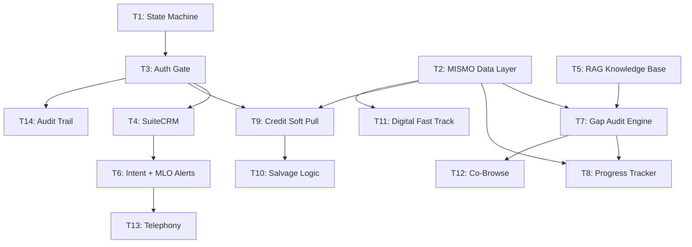

# Milestone 2 — AILANA Development Plan

---

## Task 1: Journey State Machine (P0 — Foundation)

- [ ] Define journey states enum: `PRE_AUTH → IDENTITY_GATE → INGESTION → FAST_TRACK → SUBMITTED`
- [ ] Implement React state machine with transition guards
- [ ] Block `Submit` action until `Mandatory_Field_Count === 0`
- [ ] Wire state transitions to URL/route changes
- [ ] Add state persistence (survive refresh/reconnect)
- [ ] Create state-aware UI shell (conditional rendering per phase)

---

## Task 2: MISMO v3.6.2 Data Layer (P0 — Foundation)

- [ ] Define MISMO v3.6.2 XML schema types (TypeScript interfaces)
- [ ] Build zero-parser XML ↔ JSON mapper (native, no third-party parser)
- [ ] Map URLA Sections I–VIII to MISMO containers
- [ ] Create field-level completeness index per container
- [ ] Implement merge logic for digital + manual data (deduplicate)
- [ ] Add XML validation layer (schema conformance checks)

---

## Task 3: Authentication & Identity Gate (P0 — Dependency for all data binding)

- [ ] Implement SSO provider integration (Google/Microsoft)
- [ ] Implement standard email/password auth fallback
- [ ] Build `Identity Gate` modal — blocks transition from `PRE_AUTH → INGESTION`
- [ ] Generate `User_ID` on successful auth
- [ ] Bind active LiveKit session to `User_ID`
- [ ] Handle anonymous → authenticated session migration (preserve chat history)

---

## Task 4: SuiteCRM 8.X Integration (P0 — CRM backbone)

- [ ] Set up SuiteCRM 8.X instance on GCP
- [ ] Build REST API adapter for SuiteCRM (contacts, leads, sessions)
- [ ] Implement `Data Anchor`: bind session to CRM `User_ID` on auth
- [ ] Log LiveKit session metadata to CRM (duration, mode, transcript summary)
- [ ] Create lead record on first authenticated interaction
- [ ] Build CRM webhook listener for status updates

---

## Task 5: RAG Knowledge Base (P1 — AI accuracy)

- [ ] Ingest Fannie Mae guidelines into vector store
- [ ] Ingest Freddie Mac (LPA) guidelines
- [ ] Ingest HUD/FHA guidelines
- [ ] Build retrieval pipeline (query → embed → search → context injection)
- [ ] Integrate RAG context into AILANA's Gemini system prompt per-query
- [ ] Add source citation in AI responses (`"Per Fannie Mae Section X..."`)
- [ ] Implement fallback: "This requires underwriting review" when confidence is low

---

## Task 6: Intent Detection & MLO Alerts (P1 — Conversion trigger)

- [ ] Define intent signals: requesting a person, providing property location, starting 1003
- [ ] Build intent classifier (rule-based + Gemini LLM confirmation)
- [ ] Implement SMS alert to state-licensed MLOs on intent detection
- [ ] Route alerts by applicant jurisdiction (state-specific MLO matching)
- [ ] Integrate NMLS license verification via Apify scraper
- [ ] Add MLO availability heartbeat API check before offering transfer

---

## Task 7: AI Gap Audit Engine (P1 — Core differentiator)

- [ ] Leverage Gemini's large context to validate 24-month residency continuity against MISMO XML
- [ ] Leverage Gemini's large context to validate 24-month employment continuity against MISMO XML
- [ ] Flag gaps > 30 days, generate verbal prompts for AILANA
- [ ] Implement URLA Section I–VIII field completeness scanner
- [ ] Generate per-section audit status: `COMPLETE | GAP_DETECTED | EMPTY`
- [ ] Wire audit results into AILANA's conversation context
- [ ] AILANA verbally acknowledges progress ("Asset Verification is 100% complete")

---

## Task 8: Dynamic Progress Tracker UI (P1 — Visual feedback)

- [ ] Build segmented progress bar component (one segment per URLA section)
- [ ] Bind segment state to MISMO XML container population (not clicks)
- [ ] Implement status indicators: ✅ Green (100% + AI-validated), 🟠 Orange (gaps detected)
- [ ] Add real-time update hooks: trigger on XML container write
- [ ] Display gap details on segment hover/tap
- [ ] Sync progress bar state with journey state machine

---

## Task 9: CRS Credit Soft Pull Integration (P2 — Data ingestion)

- [ ] Integrate CRS Credit API for self-administered soft pull
- [ ] Build consent flow UI (credit pull authorization)
- [ ] Map CRS response to MISMO v3.6.2 XML containers (native mapping)
- [ ] Populate UI fields from credit data
- [ ] Handle failure/decline: trigger Manual Pivot (Task 10)
- [ ] Update progress tracker on successful credit population

---

## Task 10: Salvage Logic — Manual Pivot (P2 — Zero dead-ends)

- [ ] Build "Short Form" web form (co-browse compatible)
- [ ] Implement Option A: on-screen short form with co-browse highlighting
- [ ] Implement Option B: SMS link to short form via SignalWire/Telnyx
- [ ] Implement Option C: NeetoCal scheduling fallback (API integration)
- [ ] Wire AILANA to offer pivot options on credit pull opt-out
- [ ] Merge manually entered data into MISMO containers (deduplicate with existing)

---

## Task 11: Digital Fast Track — AccountChek/Equifax (P2 — Optional acceleration)

- [ ] Integrate AccountChek API for digital asset/income verification
- [ ] Build opt-in flow UI ("Would you like to fast-track with bank linking?")
- [ ] On opt-in: suppress manual document requests for assets/income
- [ ] Map digital verification data to MISMO containers
- [ ] On opt-out: continue standard audit path with manual upload prompts
- [ ] Update progress tracker segments to reflect digital verification status

---

## Task 12: Co-Browse & NULL Field Highlighting (P2 — Guided UX)

- [ ] Implement co-browse session capability (screen sharing for form filling)
- [ ] Build NULL field detection scanner across active URLA form
- [ ] Highlight NULL/incomplete fields on applicant's screen in real-time
- [ ] Wire AILANA to verbally guide user through highlighted fields
- [ ] Sync co-browse corrections back to MISMO containers
- [ ] End co-browse gracefully on section completion

---

## Task 13: Telephony — SignalWire & fspbx (P3 — SIP/PSTN bridge)

- [ ] Configure fspbx FreeSWITCH instance with `mod_callcenter` on GCP
- [ ] Enable SignalWire SIP trunk for PSTN inbound/outbound bridging
- [ ] Bridge WebRTC (LiveKit) ↔ SIP (SignalWire + fspbx) for live transfers
- [ ] Implement queue routing: AI → MLO handoff based on intent + jurisdiction
- [ ] Add "Transfer to Loan Officer" flow in AILANA (triggering LiveKit SIP bridge)
- [ ] Implement Gemini agent hibernation logic during human handoff
- [ ] Record transferred calls with compliance disclosure

---

## Task 14: Compliance Audit Trail (P3 — Regulatory)

- [ ] Create `Consent_Events` table (immutable, append-only)
- [ ] Log consent event JSON on "I Agree" click (timestamp, hash, duration, jurisdiction)
- [ ] Create `Session_Transcripts` table (encrypted at rest, AES-256)
- [ ] Log all AI ↔ user exchanges with millisecond timestamps
- [ ] Build compliance dashboard: export "Evidence Pack" PDF by session token
- [ ] Implement 7-year retention policy with automated purge + destruction certificate

---

## Priority Summary

| Priority | Tasks | Rationale |
|---|---|---|
| **P0** | 1, 2, 3, 4 | Foundation — state machine, data layer, auth, CRM. Everything else depends on these. |
| **P1** | 5, 6, 7, 8 | Core intelligence — RAG, intent detection, audit engine, progress tracker. |
| **P2** | 9, 10, 11, 12 | Data ingestion & conversion — credit pull, salvage logic, fast track, co-browse. |
| **P3** | 13, 14 | Infrastructure & compliance — telephony bridge, audit trail persistence. |

---

## Dependency Graph

