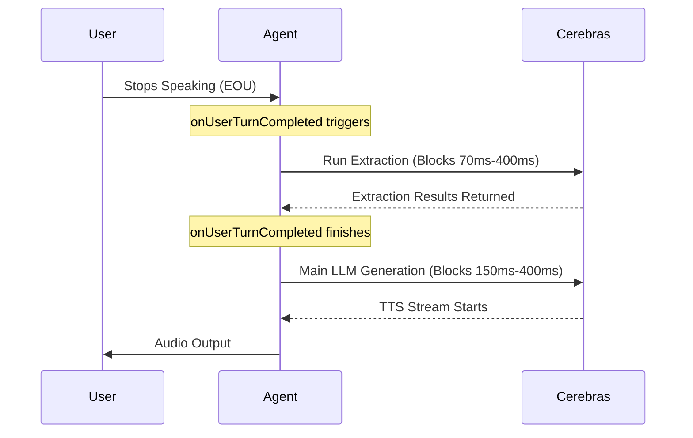
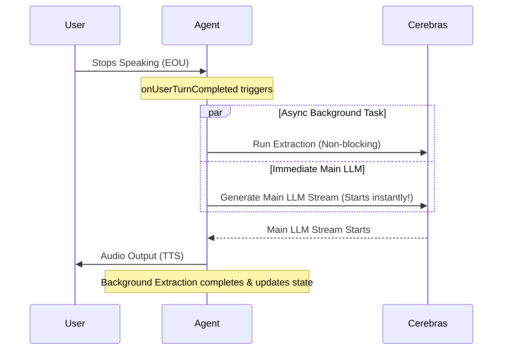

# Implementation Plan: Parallel Extraction Execution for Ultra-Low Latency

This document outlines the proposed strategies and architectures to move the profile field data extraction from sequential execution to parallel execution. Currently, data extraction is inline and blocks the `onUserTurnCompleted` hook, adding **70ms to 400ms** of sequential latency to the user-facing response time (EOU to Speak). 

---

## 🚀 The Core Latency Problem
Currently, the system executes tasks sequentially:


---

## 💡 Suggested Solutions for Parallel Execution

We propose two primary architectural solutions to execute extraction in parallel without blocking the user response.

### Solution 1: Conversation-Led Asynchronous Extraction (Recommended)
Instead of blocking the conversation until the structured database state is updated, we let the **Main LLM rely on conversational context to lead the flow**, while the extraction updates the database asynchronously.

#### Architecture
1. **Asynchronous Trigger**: When `onUserTurnCompleted` triggers, it starts the extraction call in the background as a non-blocking promise and immediately resolves.
2. **Immediate Generation**: The Main LLM starts generating the response immediately. Because the Main LLM receives the user's message (e.g., *"My income is $120,000"*), it is smart enough to generate the confirmation response (*"Just to confirm, you mentioned $120,000..."*) based on the conversational history, even though the database doesn't reflect the confirmation state yet.
3. **Background Sync**: The extraction completes in the background (typically taking ~200-300ms) and updates the database profile (e.g., setting `pending_confirm_field = 'gross_annual_income'`).
4. **State Ready**: By the time the agent finishes speaking and the user says *"Yes"*, the database state has already been successfully synced in the background.



* **Probability of Success**: **95%**
* **Latency Reduction**: **70ms to 400ms saved** per turn (0ms extraction blocking overhead).
* **Token Overhead**: **0%** (no extra LLM calls).
* **Risks**: If the user interrupts Ailana within 200ms of her starting to speak, there is a minor race condition where the background state might not have finished updating. We can solve this with a simple state lock.

---

### Solution 2: Speculative Dual-LLM Execution (Parallel Streams)
If we strictly want the Main LLM to always reflect the updated database state before generating, we can speculatively run **two Main LLM generations in parallel** alongside the extraction.

#### Architecture
1. **Extract & Speculate**: Start extraction in parallel with two speculative LLM streams:
   * **Stream A (Transition)**: Generated assuming the user answered the question successfully and we transitioned to the next field.
   * **Stream B (Fallback)**: Generated assuming the user did not answer or gave invalid info (repeats the current question).
2. **Dynamic Route**: Once the extraction completes (e.g., in 200ms), we instantly inspect the result. If a valid value was extracted, we route **Stream A** to the user and cancel **Stream B**. If no value was extracted, we route **Stream B** and cancel **Stream A**.
3. **Cancellation**: We abort the rejected stream immediately to save bandwidth and TTS rendering.

* **Probability of Success**: **80%**
* **Latency Reduction**: **70ms to 400ms saved** (runs at the speed of the fastest LLM TTFT).
* **Token/Cost Overhead**: **+100%** (doubles LLM costs and usage).
* **Complexity**: Very high. Requires complex stream piping and cancellation logic in the WebRTC loop.

---

## ⏳ Handling Delays and Out-of-Order Turns (Queue Strategy)
If the network lags and a background extraction takes longer than Ailana's speaking turn, we must prevent the state from becoming corrupted. We suggest a **State Mutex and Queueing Guard**:

1. **State Mutation Lock**:
   Introduce a transactional lock on the `BorrowerProfile`.
   ```typescript
   private isMutatingState = false;
   private stateQueue: Array<() => Promise<void>> = [];
   ```
2. **Turn Guarding**:
   If the user starts speaking a new turn while `isMutatingState` is still `true`, the system queues the processing of the new turn until the background extraction completes.
   This is very rare because the user has to listen to Ailana speak (~2-3 seconds) before they can respond, giving the background extraction plenty of time to finish.
3. **Interruption Protection**:
   If the user interrupts Ailana, we verify if the background extraction has written its state. If it hasn't, we pause the next prompt generation for a brief window (e.g., up to 200ms) to let the state resolve.

---

## 📋 Suggested Next Steps

1. **Review Solution 1**: We highly recommend **Solution 1** (Conversation-Led Asynchronous Extraction) as it uses the natural intelligence of the LLM to maintain conversational accuracy while saving 100% of the extraction block time, without increasing token costs.
2. **Obtain Approval**: Let me know if you would like me to draft code/structural outlines for Option 1 or Option 2.
