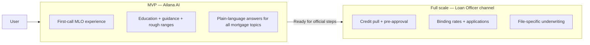
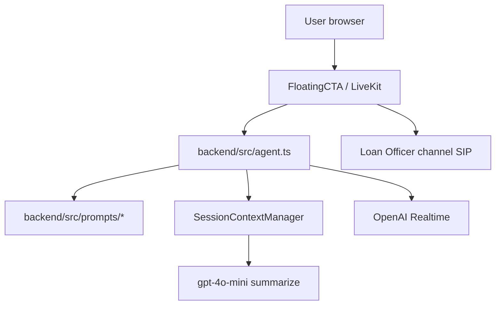
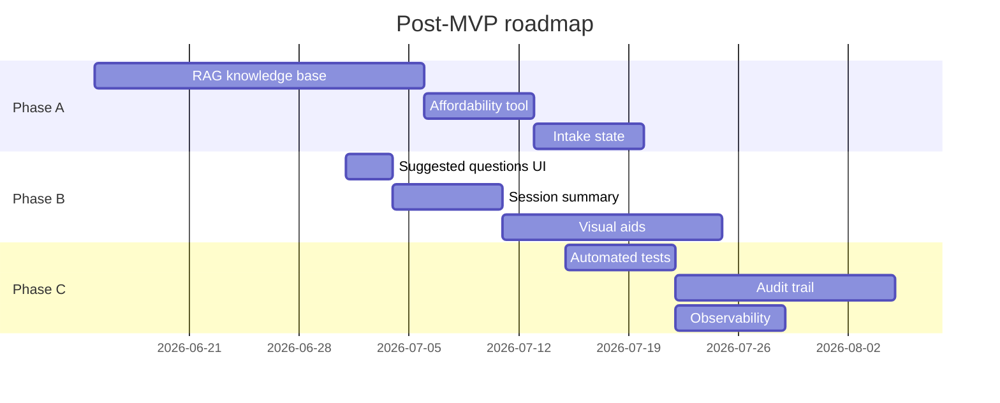

PLAN FOR LATER USE DO NOT DO ANYTHING WITH THIS NOW


!!!! DO NOT IMPLEMENT OR TOUCH ANYTHING ON THIS PLAN!!!!!!!!!!!!!!!!


# Ailana — Product & Engineering Plan

**Last updated:** June 10, 2026  
**Product stage:** MVP (prompt-driven basic MLO experience)  
**Full MLO service:** Loan Officer channel (licensed human)

---

## Product model (two tiers)



| Capability | Ailana (MVP) | Loan Officer channel |
|------------|--------------|----------------------|
| Explain mortgages, process, programs | Yes | Yes |
| Plain-language guidance for laypeople | Yes | Yes |
| Rough affordability / qualification ranges | Yes (general) | Yes (verified) |
| Document checklist guidance | Yes | Yes (personalized) |
| Credit pull / pre-approval letter | No → hand off | Yes |
| Rate lock / binding quote | No → hand off | Yes |
| Official application | No → hand off | Yes |
| Complex edge-case underwriting | Explain generally → hand off | Yes |

**MVP goal:** A confused first-time buyer (or any layperson) can talk to Ailana and feel like they had a good **first consultation with a loan officer** — informed, guided, and clear on next steps — without needing mortgage knowledge upfront.

---

## MVP status — READY (prompting + latency)

### Implemented

| Area | Status | Location |
|------|--------|----------|
| MVP scope & LO boundary | Done | `backend/src/prompts/mvp-scope.ts` |
| Universal conversation playbook | Done | `backend/src/prompts/mortgage-playbook.ts` |
| Topic patterns (all Question.md categories) | Done | `backend/src/prompts/topic-guidance.ts` |
| Compliant response templates | Done | `backend/src/prompts/compliance-responses.ts` |
| Reference qualification ranges | Done | `backend/src/prompts/qualification-ranges.ts` |
| Prompt assembly | Done | `backend/src/prompts/ailana-system.ts` |
| Context compaction (latency) | Done | `backend/src/context/session-context-manager.ts` |
| Session rotation (long calls) | Done | `backend/src/context/session-context-manager.ts` |
| Per-turn latency metrics | Done | `backend/src/metrics/latency-tracker.ts` |
| VAD tuning (200ms) | Done | `backend/src/config/ailana-config.ts` |
| Agent wiring | Done | `backend/src/agent.ts` |
| Env reference | Done | `backend/.env.example` |

### MVP prompt version

`PROMPT_VERSION=mvp-1` (default in `ailana-config.ts`)

### MVP prompt modules (how they fit together)

```
ailana-system.ts
├── mvp-scope.ts          ← What Ailana does vs Loan Officer channel
├── mortgage-playbook.ts  ← Universal flow: understand → educate → guide
├── topic-guidance.ts     ← Patterns for every mortgage topic category
├── qualification-ranges.ts ← Safe general reference numbers
└── compliance-responses.ts ← Compliant templates (no early deflection)
```

### Client issues addressed in MVP

| Original issue | MVP fix |
|----------------|---------|
| Mortgage jargon (DTI, LTV) | Plain-language rule + explain-before-acronym |
| Vague partial answers | 3–5 sentence complete answers + topic patterns |
| Assumes loan program | Discovery flow + program comparison in plain English |
| Deflects to "underwriting" | Helpful ranges first; hand off only when appropriate |
| Stuck on unknown words | Rephrase protocol in playbook + compliance templates |
| Progressive latency | Context compaction + session rotation |
| Slow baseline response | VAD 200ms + leaner turn endpointing |

### MVP acceptance tests

Run through `Question.md` — every section should pass:

1. **General mortgage info** — definitions in plain English  
2. **Home buying process** — step guidance, not vagueness  
3. **Rates & refinancing** — framework without binding rates  
4. **Loan programs** — explains options when user doesn't know  
5. **Qualifications** — ranges + disclaimer, not underwriting wall  
6. **Compliance** — correct guardrails per expected behavior  
7. **Handoff** — Loan Officer channel when official steps needed  

### MVP operational checklist

- [ ] Restart backend after prompt changes (`npm run dev` in `backend/`)
- [ ] Confirm log: `prompt=mvp-1`
- [ ] 5-minute voice session — latency stable, no jargon leaks
- [ ] 15-minute session — compaction logs appear, context preserved
- [ ] Handoff test — user asking for rate lock → Loan Officer channel offered warmly

---

## Architecture (MVP as-is)



**MVP deliberately does NOT include:** RAG, calculators, intake state DB, session PDF summaries, or automated test suite. Those are post-MVP (below).

---

# Post-MVP — Full-scale roadmap

Everything below upgrades Ailana from **prompt-only basic MLO** to **production-grade loan officer alternative**. The Loan Officer channel remains the path for licensed official actions.

---

## Phase A — Intelligence layer (highest ROI)

### A1. Verified knowledge base (RAG)

**Problem:** MVP relies on model memory for guidelines, limits, and program rules — can be stale or wrong.  
**Solution:** RAG over verified Fannie Mae, Freddie Mac, FHA, HUD sources (per `Milestone2_plan.md` Task 5).  
**Outcome:** Accurate thresholds, conforming limits, program eligibility cited per answer.

| Task | Effort |
|------|--------|
| Ingest guideline documents (MISMO / agency PDFs) | 1–2 weeks |
| Gemini or OpenAI embedding + retrieval pipeline | 1 week |
| Inject retrieved context into system prompt per turn | 3 days |
| Version-stamp knowledge base for audit | 2 days |

### A2. Compliant affordability helper (tool)

**Problem:** "How much can I qualify for?" is the #1 layperson question; prompts alone give rough ranges.  
**Solution:** Agent tool: income, monthly debts, down payment, credit band → rough range + mandatory disclaimer.  
**Outcome:** LO-quality first-call estimate without credit pull.

| Task | Effort |
|------|--------|
| Define calculation rules (DTI bands, conservative) | 2 days |
| LiveKit agent tool + spoken result formatting | 3 days |
| Compliance review of output language | 1 day |

### A3. Structured intake state

**Problem:** MVP infers user facts from chat; may re-ask or miss personalization.  
**Solution:** Lightweight session state object (goal, timeline, credit band, veteran, first-time buyer) updated each turn.  
**Outcome:** Every answer references known facts ("Since you mentioned you're a first-time buyer…").

| Task | Effort |
|------|--------|
| `UserIntakeState` module in backend | 2 days |
| Extract facts from transcript each turn (LLM or rules) | 3 days |
| Inject state block into instructions | 1 day |

---

## Phase B — Product experience

### B1. UI suggested questions (layperson starters)

Expand `suggested-commands` in the widget:

- "I want to buy a home but don't know where to start"
- "How much house might I afford?"
- "What's the difference between FHA and conventional?"
- "What documents do I need?"
- "I'd like to speak with a loan officer"

### B2. On-screen visual aids (voice + text)

Show while Ailana speaks:

- Glossary cards (DTI, PMI, escrow)
- Document checklist
- Program comparison table
- "Your next step" callout

### B3. End-of-session summary

Before close, display:

- Topics discussed
- Facts gathered
- Recommended next step
- One-click Loan Officer channel with context note

### B4. Progressive identity collection

Per `pdf.md` — after consent, optional name/phone for LO handoff so the human picks up with context.

### B5. Compliance gate alignment

Wire full disclosure language from `pdf.md` into `compliance-gate.tsx` (currently simpler than spec).

---

## Phase C — Reliability & compliance at scale

### C1. Automated regression suite

- Run all `Question.md` scenarios against agent on every deploy
- Score: plain language, no early deflection, handoff correctness
- Block release on regression

### C2. Session audit trail

Per `pdf.md` + `Milestone2_plan.md` Task 14:

- Immutable transcript log
- Consent event schema
- Disclosure version ID
- 7-year retention policy

### C3. Observability dashboard

- Latency p50/p95 vs turn number
- Compaction / rotation events
- "Deflection rate" (underwriting without helping)
- Context token growth

### C4. Specialist routing (supervisor pattern)

LiveKit supervisor agent routes by intent:

- First-time buyer specialist flow
- Refinance specialist flow
- Credit-challenged flow

### C5. Voice-only fast path

Bypass Keyframe avatar when user selects voice-only — reduces baseline latency 100–400ms.

### C6. CRM integration

Log session metadata: duration, mode, transcript summary, handoff to LO (Milestone 2).

---

## Phase D — Infrastructure

| Item | Notes |
|------|-------|
| Prisma / DB models | Conversation, consent, audit — schema currently empty |
| Env-based feature flags | `ENABLE_RAG`, `ENABLE_AFFORDABILITY_TOOL` |
| Regional OpenAI endpoint | Lower baseline latency |
| Model A/B testing | `gpt-realtime-mini` vs alternatives |

---

## Priority order (post-MVP)



**Recommended first post-MVP sprint:** A2 (affordability tool) + B1 (suggested questions) — highest user-visible impact with manageable scope.

---

## Decision log

| Decision | Choice | Rationale |
|----------|--------|-----------|
| MVP intelligence | Prompt-only | Ship fast; LO channel covers official steps |
| MVP vs full LO | Two-tier product | Clear compliance boundary |
| Context strategy | Summary + recent turns | Stable latency on long calls |
| Full-scale knowledge | RAG (not bigger prompts) | Accurate, auditable guidelines |
| Handoff | Loan Officer channel | Already built; don't duplicate in AI |

---

## File reference

| MVP (now) | Post-MVP |
|-----------|----------|
| `backend/src/prompts/*` | `backend/src/tools/affordability.ts` |
| `backend/src/context/session-context-manager.ts` | `backend/src/intake/user-state.ts` |
| `backend/src/metrics/latency-tracker.ts` | RAG pipeline + dashboard |
| `backend/src/agent.ts` | Prisma models + audit API |
| `Question.md` (manual QA) | Automated test runner |
| `pdf.md` (spec) | Compliance gate + audit PDF export |

---

## What NOT to do in MVP

- Do not add RAG, DB persistence, or calculators until post-MVP phases  
- Do not make Ailana pretend to be a licensed LO  
- Do not route every answer to the Loan Officer channel  
- Do not switch to Gemini without benchmarking (reverted previously for stutter)

**MVP is complete when:** a layperson with zero mortgage knowledge can have a 10–15 minute conversation, feel informed like after a first LO call, and know whether to continue with Ailana or click Loan Officer channel — with stable latency and no jargon traps.
