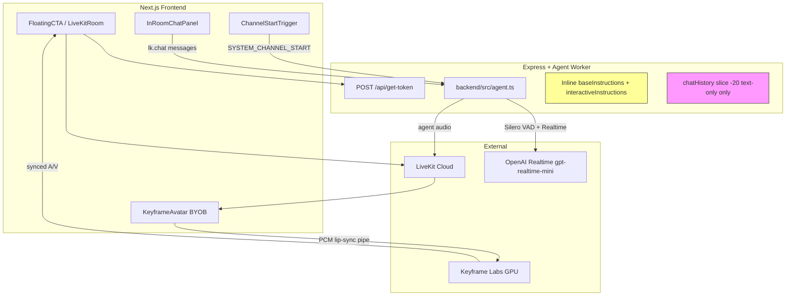
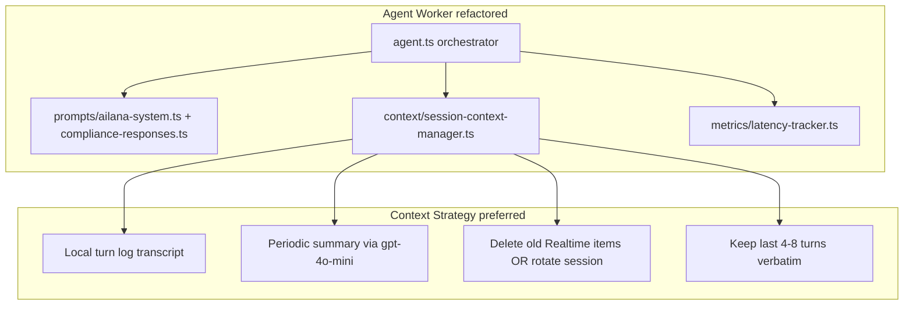
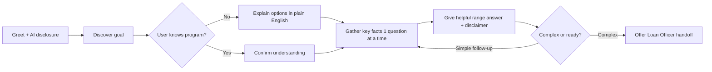
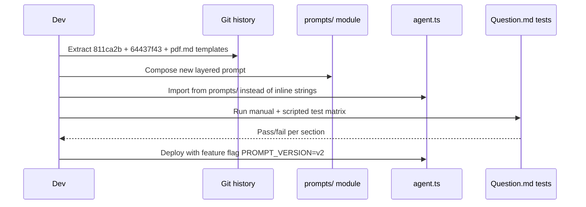
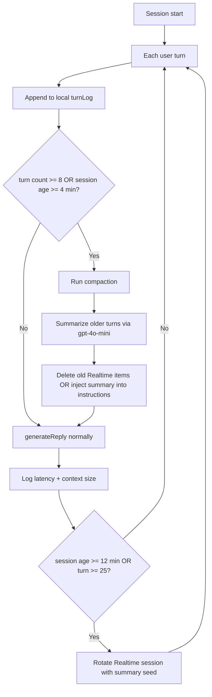
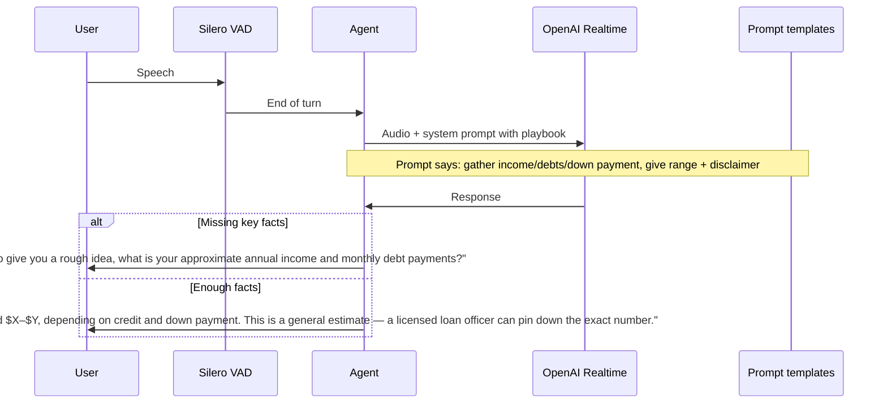
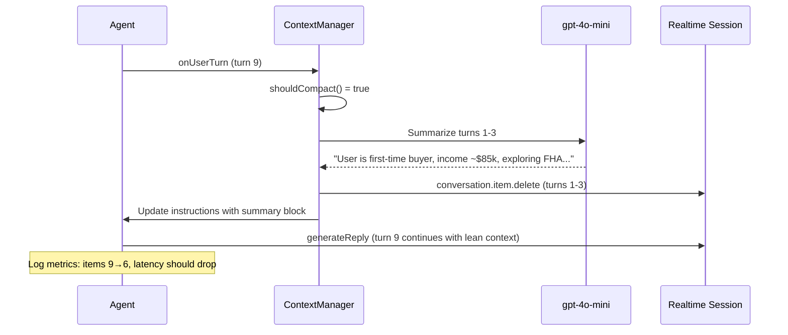
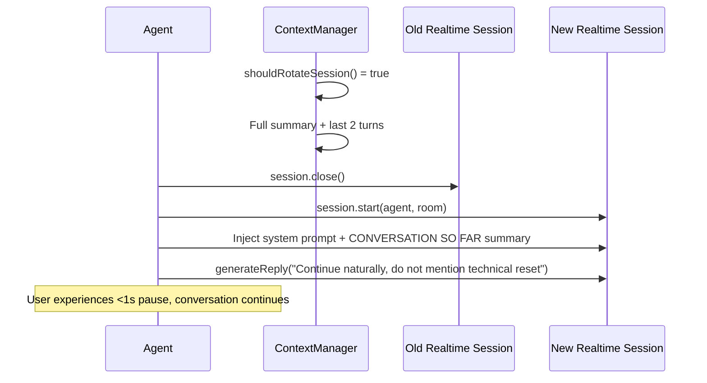
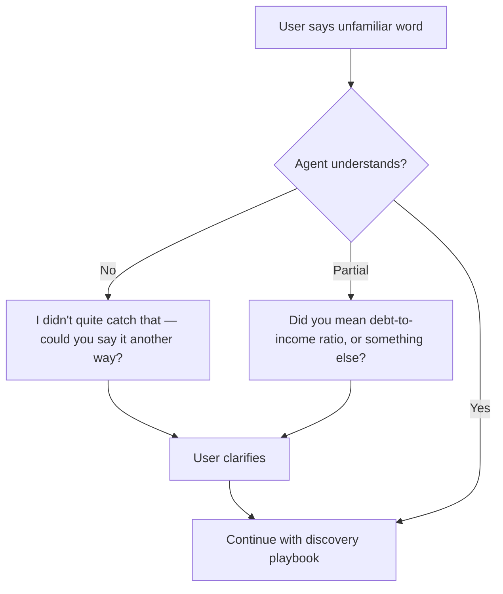

# Ailana Voice Agent — Remediation Plan

**Status:** Planning only (no implementation yet)  
**Date:** June 10, 2026  
**Scope:** Fix conversation quality / prompting issues **and** stabilize latency for 15–30 minute voice sessions.

---

## Executive Summary

Client feedback identifies two intertwined problems:

1. **Conversation quality** — Ailana is slow to feel helpful, uses mortgage jargon (DTI/LTV), gives vague partial answers, assumes users know loan programs, deflects qualification questions to "underwriting," and stalls on unfamiliar words.
2. **Progressive latency** — Response time is already too high at session start, then degrades further after ~4–5 minutes of continuous conversation.

**Codebase finding:** Production runs **OpenAI Realtime** (`gpt-realtime-mini`) via LiveKit Agents — not Gemini. Gemini was used temporarily (commits `7db8fe68`–`3cc462b`) and reverted (`6028b80f`). Client references to "before Gemini" likely mean the **early OpenAI Realtime era** (simple conversational prompt + server VAD) or the **structured prompt era** (`811ca2b`).

**Critical architectural finding:** In voice mode, **conversation history accumulates indefinitely** inside the OpenAI Realtime session. There is **no pruning, summarization, or session rotation**. Text-only fallback truncates to 20 messages, but voice mode has zero context management. This is the primary suspect for progressive latency.

This plan addresses both problems in parallel phases, with instrumentation first so improvements are measurable.

---

## Current Architecture (As-Is)



### Key files today

| File | Role |
|------|------|
| `backend/src/agent.ts` | **Single source of truth** — model config, prompts, session lifecycle, text fallback |
| `src/components/keyframe-avatar.tsx` | BYOB avatar — adds audio pipeline latency |
| `src/components/floating-cta/channel-start-trigger.tsx` | Session start signaling (retries at 0s, 2s, 4.5s) |
| `Question.md` | Test matrix — expected behaviors not enforced in prompt |
| `pdf.md` | Compliance templates + sample compliant responses — **not wired into agent** |

### What changed since the "good" era

| Dimension | Early OpenAI (`64437f43`) | Structured prompt (`811ca2b`) | Current (`837167d`) |
|-----------|---------------------------|-------------------------------|---------------------|
| Prompt length | ~3 lines, conversational | Structured sections, underwriter simulation | Shorter but **more restrictive** brevity rules |
| Model | `gpt-4o-realtime` + server VAD | `gpt-4o-mini-realtime-preview` | `gpt-realtime-mini` |
| VAD | OpenAI server VAD (400ms silence) | Silero + hybrid | Silero only (`minSilenceDuration: 300`) |
| Response style | "Incredibly concise" | Natural structure: understand → risk → guidance → question | **Hard 1–2 sentences**, heavy fail-safe |
| Avatar | LemonSlice (in-room) | Keyframe BYOB | Keyframe BYOB |
| Context mgmt | None | None | None (text-only: slice -20) |

---

## Root Cause Analysis

### Problem A — Conversation Quality

| Symptom | Root cause in code / prompt |
|---------|----------------------------|
| Uses jargon (DTI, LTV) | Internal checklist names acronyms; no rule to explain in plain English before using them |
| Vague, partial answers | `RESPONSE STYLE — STRICT: 1–3 sentences` + `pick the most important one` discourages complete answers |
| Assumes loan program | No discovery flow; no prompt to ask goals first (first-time buyer, refi, etc.) |
| Deflects qualification | `FAIL-SAFE` and `MORTGAGE BEHAVIOR` repeatedly route to "underwriting review" / "needs review" |
| Stalls on unknown words | No recovery protocol for misheard terms, typos, or out-of-domain words |
| Poor conversation flow | `Ask only 1 question at a time` without a conversation **playbook** (discover → educate → estimate → handoff) |
| Compliance vs helpfulness | `pdf.md` has **crafted compliant responses**; agent prompt only has blanket deflection |

### Problem B — Latency

#### B1. Baseline latency (slow from the first turn)

Contributing factors (ranked by likely impact):

1. **Keyframe BYOB pipeline** — Agent audio → browser AudioWorklet → Keyframe WebRTC → rendered A/V back. Adds 100–400ms+ perceived delay vs direct agent audio.
2. **Silero VAD endpointing** — `minSilenceDuration: 300`, `minDelay: 300` adds post-speech wait before inference starts.
3. **Dual-path message routing** — Chat messages go through data channel handlers before `generateReply`, not pure audio turn-taking.
4. **Channel start delay** — Recording announcement → `SYSTEM_CHANNEL_START` retries (0/2/4.5s) before session starts.
5. **Model change** — `gpt-4o-mini-realtime-preview` → `gpt-realtime-mini` may have different latency profile (needs benchmarking).
6. **Large system prompt** — ~1,200 tokens of instructions on every inference pass.

#### B2. Progressive latency (degrades after 4–5 minutes)

| Hypothesis | Evidence | Verdict |
|------------|----------|---------|
| Realtime session context grows unbounded | No `conversation.item.delete`, no summarization, no rotation in `agent.ts` | **Confirmed — primary cause** |
| LiveKit chat context grows | Voice mode does not maintain local `chatHistory`; OpenAI Realtime holds server-side items | **Confirmed** |
| Keyframe session degradation | No evidence in code; possible but secondary | Investigate via A/B |
| OpenAI session internal drift | Community reports: cleanup does not always restore initial latency; session rotation may be required | **Plan for rotation, not just delete** |

**Conclusion:** Context growth is the **likely cause** of latency increase after 4–5 minutes. However, fixing context alone will not restore the "fast" feel of the earliest version if baseline latency from avatar + VAD + routing is high.

---

## Target Architecture (To-Be)



---

## Solution Strategy Overview

| Track | Approach | Priority |
|-------|----------|----------|
| **1. Instrumentation** | Log per-turn latency, turn count, estimated context size | P0 — do first |
| **2. Prompt rewrite** | Restore conversational depth + compliance templates + plain language | P0 |
| **3. Context management** | Summary + recent turns (preferred); session rotation for 15–30 min | P0 |
| **4. Baseline latency** | VAD tuning, voice-only benchmark, lean prompt, optional direct audio path | P1 |
| **5. Testing** | Automated against `Question.md` + 15/30 min soak tests | P1 |

---

# Track 1 — Instrumentation (Do Before Any Fix)

## Goal

Prove whether context growth correlates with latency increase. Establish baseline metrics to validate fixes.

## New module: `backend/src/metrics/latency-tracker.ts`

Responsibilities:

- Record per-turn timestamps:
  - `user_speech_end` (VAD endpoint)
  - `generate_reply_called`
  - `agent_first_audio` / `agent_first_text` (from session events)
- Compute: `e2e_latency_ms`, `ttft_ms`
- Track: `turn_number`, `session_age_seconds`, `estimated_context_items`
- Emit structured JSON logs: `[ailana-metrics] { ... }`

## Hook points in `agent.ts`

```text
AgentSessionEventTypes.AgentStateChanged  → state transitions
AgentSessionEventTypes.UserInputTranscribed → user turn complete
AgentSessionEventTypes.ConversationItemAdded → context growth (if available)
generateReply() calls                       → turn start
```

## Context size measurement

Maintain a local `turnLog: Array<{role, text, timestamp, itemId?}>` mirrored from transcription events. Log:

- `turnLog.length`
- `total_estimated_tokens` (chars / 4 approximation)
- On compaction: `items_before`, `items_after`, `summary_tokens`

## Success criteria for instrumentation

- [ ] Per-turn latency logged for 100% of turns
- [ ] Dashboard or log query can plot latency vs turn number
- [ ] Can confirm correlation: latency ↑ as turn count ↑

---

# Track 2 — Prompt & Conversation Quality Remediation

## Design principles

1. **Plain language first** — Never say DTI/LTV/AUS without plain-English explanation in the same breath.
2. **Helpful within compliance** — Use crafted responses from `pdf.md`, not blanket "underwriting" deflection.
3. **Discovery before assumptions** — Ask what the user is trying to do before discussing loan programs.
4. **Complete but spoken** — 2–4 sentences for mortgage answers; up to 5 when explaining qualification ranges.
5. **Graceful recovery** — Protocol for unknown words / misheard audio.

## Prompt file structure (new)

```text
backend/src/prompts/
  ailana-system.ts          # Core identity + conversation playbook
  compliance-responses.ts   # Crafted compliant templates (from pdf.md)
  qualification-ranges.ts   # Safe general ranges with disclaimers
  index.ts                  # Assembles final system prompt
```

## Conversation playbook (add to system prompt)



### Phase 2A — Restore structured response style (from `811ca2b`, improved)

Replace current `RESPONSE STYLE — STRICT` block with:

```text
RESPONSE STYLE:
- For greetings and simple chat: 1-2 sentences.
- For mortgage questions: 2-4 sentences covering (1) direct answer, (2) one practical consideration, (3) optional clarifying question.
- For qualification questions: give a helpful general range or typical requirement, then add a non-binding disclaimer. Do NOT deflect to "underwriting" unless the scenario is genuinely complex.
- Never give multi-part numbered lists aloud. Speak in flowing sentences.
```

### Phase 2B — Plain language rule (fixes jargon)

```text
PLAIN LANGUAGE:
- Never use acronyms (DTI, LTV, PMI, AUS, APR) without immediately explaining them in simple terms.
  Example: "your debt-to-income ratio, which is how much of your monthly income goes to debt payments"
- If the user says an unfamiliar word, ask them to rephrase or spell it. Never go silent or ignore it.
- Assume the user is new to mortgages unless they demonstrate expertise.
```

### Phase 2C — Loan program discovery (fixes assumption problem)

```text
DISCOVERY (before recommending a program):
- Early in the conversation, understand: Are they buying, refinancing, or just exploring?
- If they don't mention a loan type, do NOT assume one. Instead explain 2-3 common paths in plain English (FHA for lower down payment, conventional for standard buyers, VA for veterans) and ask which sounds closest to their situation.
- Guide, don't interrogate. One discovery question per turn.
```

### Phase 2D — Compliance-crafted responses (fixes underwriting deflection)

Port templates from `pdf.md` into `compliance-responses.ts`:

| User intent | Crafted compliant response pattern |
|-------------|-----------------------------------|
| "How much can I qualify for?" | "Based on typical guidelines, buyers with your income range often qualify for homes in the $X–$Y range, but this is a rough estimate — credit, debts, and down payment change the number. A licensed loan officer can give you an exact figure. Want me to walk through what affects it?" |
| "What's my rate?" | "Rates depend on credit, down payment, and loan type — I can't lock a rate, but today's market averages are around [range if known]. Would you like to speak with a licensed MLO for a personalized quote?" |
| "Am I approved?" | "I can't approve or deny loans, but based on what you've shared, you may be in a good position / may need to work on [specific factor]. A loan officer can verify with a pre-approval." |
| Unknown word / confusion | "I didn't quite catch that — could you say it another way? I want to make sure I help you with the right answer." |

**Important:** Ranges use words like "typically," "often," "many buyers" — never "you qualify for exactly."

### Phase 2E — Soften fail-safe (keep compliance, remove paralysis)

Replace current blanket fail-safe:

```text
FAIL-SAFE (compliant):
- You may share general industry guidelines and typical ranges.
- You must NOT guarantee approval, deny anyone, or quote binding rates.
- After giving helpful general guidance, add: "A licensed loan officer can confirm the exact numbers for your situation."
- Only say "this needs underwriting review" for genuinely complex edge cases (recent bankruptcy, non-standard income, investment property with high DTI).
```

### Phase 2F — Greeting improvement

Replace generic `generateReply` greeting with compliance-aware opener (from `pdf.md` audit sample):

```text
"Hi, I'm Ailana, an AI mortgage assistant — I'm here to help with general mortgage questions, though I'm not a licensed loan officer. What are you hoping to learn about today?"
```

### Phase 2G — Qualification knowledge module

Create `qualification-ranges.ts` with **general, cite-able guidelines** the model can reference:

- Typical minimum credit scores by program (FHA ~580, conventional ~620) — with "varies by lender" disclaimer
- Typical DTI limits (conventional ~43–50%, FHA can be higher with compensating factors)
- Down payment ranges (FHA 3.5%, conventional 3–5%, VA 0%)

These are **prompt context**, not RAG (RAG is Milestone 2). Keeps answers specific without inventing numbers.

## Prompt migration flow



## Files to change (prompt track)

| File | Change |
|------|--------|
| `backend/src/agent.ts` | Import assembled prompt; remove inline `baseInstructions` |
| `backend/src/prompts/ailana-system.ts` | **New** — core identity + playbook |
| `backend/src/prompts/compliance-responses.ts` | **New** — crafted response templates |
| `backend/src/prompts/qualification-ranges.ts` | **New** — safe reference ranges |
| `backend/src/prompts/index.ts` | **New** — `buildSystemPrompt(version?)` |

## Prompt testing checklist (from `Question.md`)

| Section | # Tests | Pass criteria |
|---------|---------|---------------|
| General mortgage info | 7 | Plain English, no jargon without explanation |
| Home buying process | 9 | Guides step-by-step, doesn't assume program |
| Rates & refinancing | 7 | No binding rates; offers MLO handoff |
| Loan programs | 7 | Explains options when user doesn't know |
| Qualifications | 6 | Gives ranges + disclaimer, not "underwriting" |
| Compliance | 4 | Correct guardrails per expected behavior |
| Handoff | 5 | Smooth Loan Officer channel direction |

---

# Track 3 — Context Management & Latency Stabilization

## Evaluation: Sliding Window vs Summary + Recent Turns

| Approach | Pros | Cons | Recommendation |
|----------|------|------|----------------|
| **Sliding window** (last 4–10 turns) | Simple, fast to implement | Loses long-session context; abrupt forgetting | Good as **Phase 1** quick win |
| **Summary + recent turns** | Preserves key facts; lower token count; LiveKit `ChatContext._summarize` pattern exists | Summarization call adds ~1–2s every N turns; must handle Realtime API specifics | **Preferred production solution** |
| **Full session rotation** | Resets latent OpenAI session drift; community-recommended for 15–30 min | Complex; brief audio gap during swap; needs summary reseed | **Required for 15–30 min calls** |

## Recommended hybrid strategy



### Thresholds (tunable via env)

| Parameter | Default | Env var |
|-----------|---------|---------|
| Turns before compaction | 8 | `AILANA_COMPACT_EVERY_N_TURNS` |
| Time before compaction | 4 min | `AILANA_COMPACT_EVERY_MS` |
| Recent turns to keep verbatim | 6 | `AILANA_KEEP_RECENT_TURNS` |
| Session rotation interval | 12 min | `AILANA_ROTATE_SESSION_MS` |
| Max turns before rotation | 25 | `AILANA_ROTATE_EVERY_N_TURNS` |

## New module: `backend/src/context/session-context-manager.ts`

### Responsibilities

```typescript
// Pseudocode — exact implementation in Phase 3

class SessionContextManager {
  private turnLog: Turn[];
  private conversationSummary: string | null;
  private lastCompactAt: number;
  private turnCount: number;

  onUserTurn(text: string): void;
  onAgentTurn(text: string): void;

  shouldCompact(): boolean;
  shouldRotateSession(): boolean;

  async compact(realtimeSession): Promise<void>;
  // 1. Split turnLog into head (summarize) + tail (keep)
  // 2. Call gpt-4o-mini to summarize head
  // 3. Delete head items from Realtime session
  // 4. Store summary; inject into system instructions

  async rotateSession(agent, room): Promise<void>;
  // 1. Summarize full turnLog
  // 2. Stop current Realtime session
  // 3. Start new session with: system prompt + summary + last 2 turns
  // 4. Brief continuance greeting optional

  getMetrics(): ContextMetrics;
}
```

### OpenAI Realtime API operations needed

Per OpenAI docs and community best practices:

| Operation | Purpose | When |
|-----------|---------|------|
| `conversation.item.delete` | Remove old items server-side | Every compaction cycle |
| `conversation.item.truncate` | Align context with audio user actually heard | On user interruption |
| Session reseed | Fresh session with summary in instructions | Every 12 min or 25 turns |
| Lean system instructions | Reduce per-turn token load | Always |

### Accessing Realtime session from LiveKit

The Gemini-era code (`3cc462b`) had a pattern for accessing the underlying realtime session:

```text
getAgentRealtimeSession(agentSession) → realtimeSession.sendClientEvent(...)
```

**Action:** Investigate LiveKit Agents `^1.2.6` OpenAI plugin for equivalent API. If not exposed, options:

1. Upgrade `@livekit/agents-plugin-openai` and use documented hooks
2. Access internal `realtimeSession` (as Gemini code did) with typed wrapper
3. Fall back to **full session restart** via `session.start()` with summary injection

### Summary prompt template

```text
Summarize this mortgage consultation conversation for continuity. Preserve:
- User's goal (buy/refi/explore)
- Key facts: income range, credit estimate, down payment, property type, location if mentioned
- Programs discussed
- Open questions
- Any qualification estimates already given

Do NOT include filler. Max 150 words. Output plain text only.

Conversation:
{head_turns_xml}
```

### Interruption handling

On `AgentStateChanged` → interrupted:

- Call `conversation.item.truncate` for the partial assistant response
- Prevents context from containing unspoken text (reduces drift and confusion)

## Text-only mode alignment

Currently `chatHistory.slice(-20)` is separate from voice context.

**Fix:** Share `SessionContextManager.turnLog` between voice and text-only paths. When voice muted, text mode uses same summary + recent turns assembly.

## Baseline latency improvements (Track 3B)

Run in parallel after instrumentation confirms bottlenecks.

| Change | File | Expected impact |
|--------|------|-----------------|
| Reduce `minSilenceDuration` 300→200ms | `agent.ts` | −100ms endpointing |
| Reduce `minDelay` 300→200ms | `agent.ts` | −100ms turn detection |
| Add `voice-only` mode bypassing Keyframe | `video-stage.tsx`, `floating-cta` | −100–400ms in voice mode |
| Lean system prompt (split static compliance to tool/lookup later) | `prompts/` | −50–100ms TTFT |
| Benchmark `gpt-realtime-mini` vs `gpt-4o-mini-realtime-preview` | `agent.ts` env `REALTIME_MODEL` | TBD |
| Pre-warm VAD at worker init, not per job | `agent.ts` | −200ms cold start |

### A/B test matrix for baseline latency

| Config | Avatar | VAD silence | Model |
|--------|--------|-------------|-------|
| A (current) | Keyframe | 300ms | gpt-realtime-mini |
| B | Direct audio | 300ms | gpt-realtime-mini |
| C | Keyframe | 200ms | gpt-realtime-mini |
| D | Direct audio | 200ms | gpt-4o-mini-realtime-preview |

Measure p50/p95 e2e latency for first turn and turn 20.

## Files to change (latency track)

| File | Change |
|------|--------|
| `backend/src/context/session-context-manager.ts` | **New** — compaction, rotation, turn log |
| `backend/src/metrics/latency-tracker.ts` | **New** — per-turn metrics |
| `backend/src/agent.ts` | Wire context manager + metrics; interruption truncate |
| `backend/.env.example` | **New** — compaction/rotation tuning vars |
| `backend/package.json` | Possibly upgrade `@livekit/agents*` if newer exposes Realtime events |

---

# Track 4 — Implementation Phases & Timeline

## Phase 0 — Baseline measurement (1–2 days)

- [ ] Add `latency-tracker.ts` with console/JSON logging
- [ ] Add local `turnLog` counter (no compaction yet)
- [ ] Run 3 sessions: 5 min, 15 min, 30 min
- [ ] Run A/B: avatar vs voice-only
- [ ] Document: latency at turn 1, 10, 20, 30 vs context size
- [ ] **Gate:** Confirm correlation before building compaction

## Phase 1 — Quick wins (2–3 days)

- [ ] Extract prompts to `backend/src/prompts/`
- [ ] Deploy prompt v2 (plain language, discovery, crafted responses)
- [ ] Reduce VAD delays (200ms)
- [ ] Update greeting `generateReply` text
- [ ] Run `Question.md` manual test pass
- [ ] **Gate:** Client review on 5 recorded scenarios

## Phase 2 — Context compaction (3–5 days)

- [ ] Implement `SessionContextManager`
- [ ] Implement sliding window delete (last 6 turns kept) as interim
- [ ] Add `gpt-4o-mini` summarization for head turns
- [ ] Inject summary into system instructions post-compaction
- [ ] Wire `conversation.item.delete` or equivalent
- [ ] Add `conversation.item.truncate` on interruption
- [ ] Unify text-only and voice context paths
- [ ] **Gate:** 15-min soak test — latency at turn 30 within 1.5× turn 1

## Phase 3 — Session rotation for long calls (2–3 days)

- [ ] Implement rotation at 12 min / 25 turns
- [ ] Summary reseed into new Realtime session
- [ ] Optional brief "still here with you" bridge phrase
- [ ] Handle MLO hibernation + resume with context restore
- [ ] **Gate:** 30-min soak test — no runaway latency

## Phase 4 — Production hardening (2–3 days)

- [ ] Env-based tuning for compaction thresholds
- [ ] Feature flags: `PROMPT_VERSION`, `CONTEXT_STRATEGY`
- [ ] Error handling for failed summarization (fall back to sliding window)
- [ ] Document operational runbook
- [ ] Optional: export metrics to Datadog/Cloud Logging

**Total estimated effort:** 10–15 dev days

---

# Detailed Flows

## Flow 1 — User asks "How much can I qualify for?"



## Flow 2 — Context compaction mid-session



## Flow 3 — Session rotation at 12 minutes



## Flow 4 — Unknown word recovery



---

# OpenAI Realtime & LiveKit Best Practices (Applied)

| Practice | Source | Our application |
|----------|--------|-----------------|
| Keep system instructions lean | LiveKit latency blog | Split compliance templates; inject only active section |
| Trim/summarize older turns | LiveKit `ChatContext._summarize` | `SessionContextManager` every 8 turns |
| `conversation.item.truncate` on interrupt | OpenAI Realtime manual | Wire to interruption events |
| `conversation.item.delete` for old items | OpenAI community | Delete summarized head turns |
| Rotate sessions every 8–12 min | Production guides 2026 | Rotate at 12 min with summary reseed |
| Monitor per-turn latency metrics | LiveKit Agent Observability | `latency-tracker.ts` |
| Session max ~30 min | OpenAI docs | Rotation + reseed before limit |
| Regional proximity to OpenAI | Production guides | Ensure GCP/backend region aligned |
| Do not let context grow unbounded | Multiple sources | **Currently violated — fix in Phase 2** |

---

# Risks & Mitigations

| Risk | Impact | Mitigation |
|------|--------|------------|
| Compaction does not reduce latency (OpenAI internal drift) | Medium | Session rotation (Phase 3) |
| Summarization call adds audible pause | Low | Run compaction during user speech or between turns; keep summary prompt short |
| Prompt v2 gives over-confident qualification numbers | High | Ranges only + mandatory disclaimer; test against compliance section |
| LiveKit plugin does not expose `conversation.item.delete` | Medium | Session restart fallback; upgrade plugin |
| Context lost on MLO handoff/resume | Medium | Persist `turnLog` in memory across hibernation; re-inject on resume |
| Keyframe latency dominates | Medium | Voice-only path for users who disable avatar |

---

# Success Metrics

| Metric | Current (est.) | Target |
|--------|----------------|--------|
| Turn 1 e2e latency (p50) | Unknown — measure | < 1.2s voice-only, < 1.8s with avatar |
| Turn 20 e2e latency (p50) | ~3× turn 1 (client report) | ≤ 1.5× turn 1 |
| Turn 30 e2e latency (p50) | Degrades further | ≤ 1.5× turn 1 |
| Jargon without explanation | Frequent (DTI, LTV) | 0 in 20 test questions |
| Qualification deflection rate | High ("underwriting") | < 20% — most get range + disclaimer |
| `Question.md` pass rate | Unknown | ≥ 85% sections pass |
| Session abandonment (client) | High | Qualitative improvement in client review |

---

# What NOT to do (yet)

- **Do not switch to Gemini** — client wants previous OpenAI-era quality; Gemini was reverted for stutter/stall issues.
- **Do not implement RAG/MISMO** — that's Milestone 2; prompt-based ranges are sufficient for now.
- **Do not persist transcripts to DB** — out of scope unless compliance requires for this sprint.
- **Do not only shorten the prompt** — brevity is part of the current problem for mortgage answers.

---

# Appendix A — Git commits for prompt archaeology

Use these to recover historical prompts during Phase 1:

```bash
git show 64437f43:backend/src/agent.ts   # Original: 3-line conversational prompt, server VAD
git show 811ca2b:backend/src/agent.ts   # Structured underwriter simulation (recommended base)
git show 837167d:backend/src/agent.ts   # Current production prompt
git diff 811ca2b..837167d -- backend/src/agent.ts  # What regressed
```

## Key regression in `811ca2b` → `837167d`

- Removed structured response flow (understand → risk → guidance → question)
- Added harsher 1–2 sentence cap
- Added "pick the most important one" rule
- Added explicit DTI/LTV in internal checklist without plain-language guard
- Added repetitive fail-safe to underwriting

---

# Appendix B — Environment variables (proposed)

```env
# Model
REALTIME_MODEL=gpt-realtime-mini
REALTIME_VOICE=coral
SUMMARIZATION_MODEL=gpt-4o-mini

# Context management
AILANA_COMPACT_EVERY_N_TURNS=8
AILANA_COMPACT_EVERY_MS=240000
AILANA_KEEP_RECENT_TURNS=6
AILANA_ROTATE_SESSION_MS=720000
AILANA_ROTATE_EVERY_N_TURNS=25

# Feature flags
PROMPT_VERSION=v2
CONTEXT_STRATEGY=summary_plus_recent
```

---

# Appendix C — Decision log

| Decision | Choice | Rationale |
|----------|--------|-----------|
| Context strategy | Summary + recent turns | Preserves continuity; lower tokens; LiveKit pattern |
| Sliding window | Interim only in Phase 2 | Quick to ship; replace with summary |
| Session rotation | Yes, at 12 min | Community evidence that delete alone insufficient |
| Prompt base | `811ca2b` structure + `pdf.md` templates | Client liked early OpenAI era; structured version was most complete |
| Gemini | No | Reverted in production; not the fix |
| Instrumentation | Before fixes | Cannot validate latency fix without metrics |

---

## Next step

**Approve this plan**, then begin **Phase 0 (instrumentation)** immediately. Phase 0 output (latency vs turn correlation chart) should be reviewed before merging Phase 2 context compaction.
